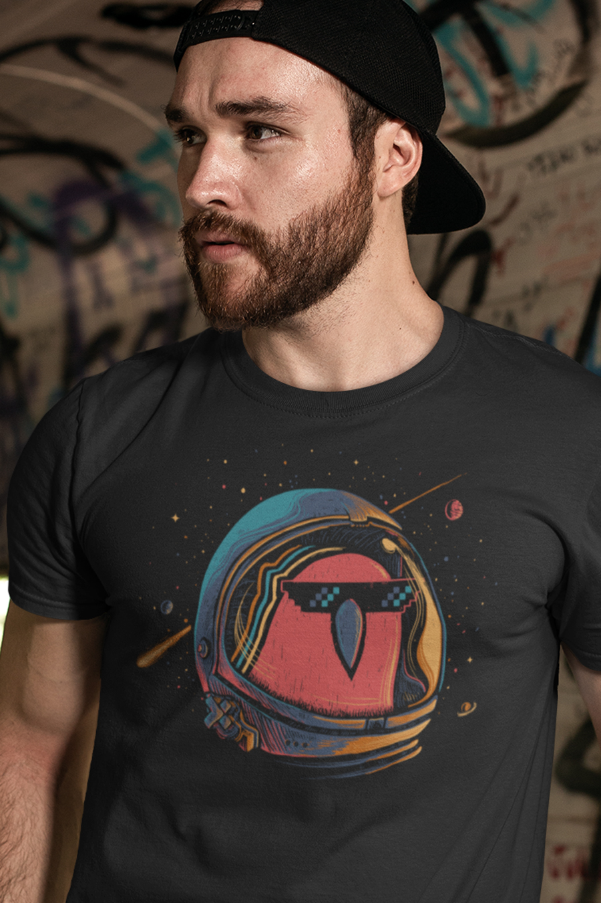
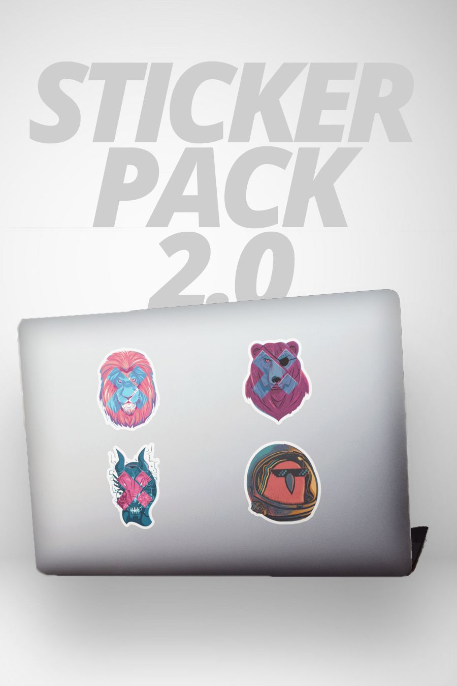
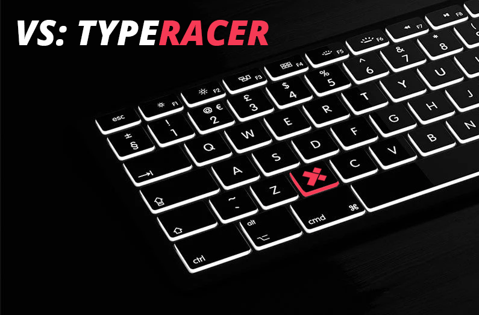
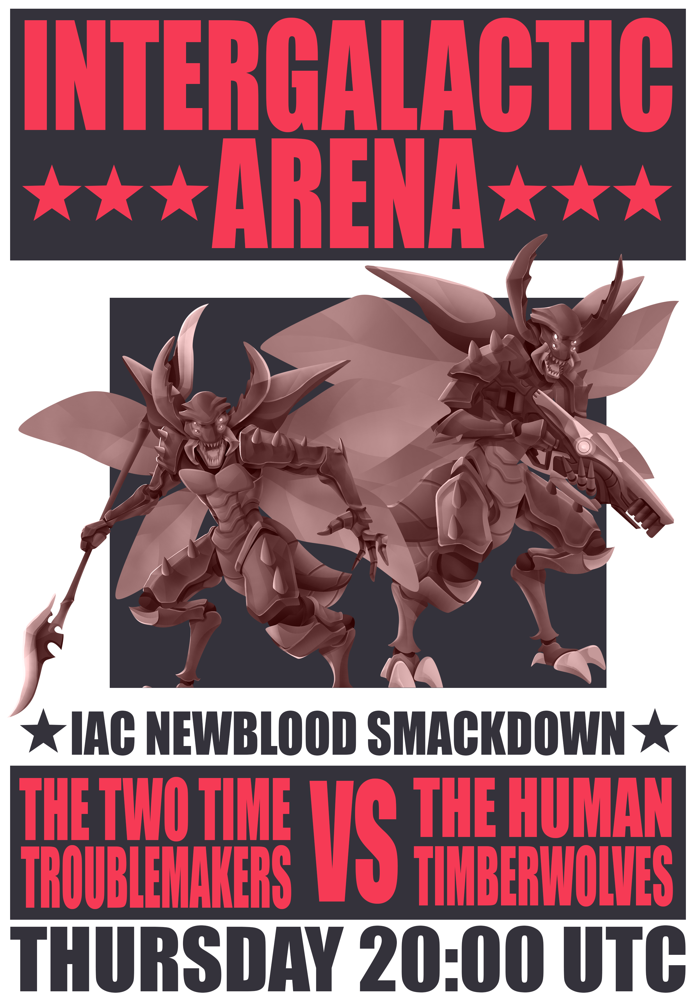

# Guide

## Introduction

Welcome to **Season 5:** _**NEW WORLD.**_



> "There are new worlds all around us, always waiting, waiting for us to put in the time to unlock them."

If you want to wake up like the  emoji, it begins by finding and unlocking a new world.Your first "Hello World" in HTML **unlocked** the massive world of coding: more tutorials, more people you could learn from, more events you could attend. New worlds are **expansion packs to life.** 

We fill our veins with excitement when we stand at the edge of a new world. Use these next 3 months to find one, and unlock all it has to offer.

###  **What world will you unlock this season?** 


 **If this is your first time participating in a Season at X-Team**, Seasons are 3 month experiences crafted to help you learn, grow and explore. Each theme has its own theme and accompanying Events, Bounties, Collectibles, and more which you'll find out more about below.


## Bounties

This season's bounties will not only help you discover a new world that will fill your veins with excitement, but also help you then dive into it.

A great starting place is this Bounty:

 **New Passions:** Join one of the \#club- channels on Slack that you have never experienced before.:

​Once you've chosen a new world you want to explore, consider these Bounties to help you start diving in and learning more from people who are already really passionate about that world:


Consider using your Unleash+ to get a membership to [MasterClass](https://www.masterclass.com/) which can introduce you to a ton of awesome new worlds and crack open your mind.


## The Vault

You can earn coins or stars by participating in [Events](guide.md#events) or completing [Bounties](guide.md#bounties). These let you purchase collectibles or donate to causes in [The Vault.](http://xhq.x-team.com/vault)


If you're working on an X-Team team, you'll guaranteed get 1 Star, which lets you buy any 1 item. Didn't get one and you're currently working on a team? Ping Elaine Lithgow on Slack!


### This Season's Launch Collectibles

Also coming this Season to The Vault:

* **Community Collab:** The community will work together on making an exclusive shirt, featuring a Legendary character of their choice who fits the season's theme. Past characters include Link from Zelda, Super Mario and Goku.
* **\#FightingChance shirt**: To support our campaign to go carbon neutral this year, we're releasing a collectible shirt featuring Ryu fighting climate change using the power of Earth.
* **Featured Causes:** We'll be supporting causes that bring good to the countries our X-Outposts will be visiting this season.
* And more surprises...

## Unleash+

Unleash+ is your $2,500 per year budget to spend toward activities and gear that energize you. Use it this season to help you discover and dive into a New World.

We've also three new categories you might enjoy:

**Ergonomics:** $200/mo toward gear you need to improve the ergonomics of your work setup.

**Smart Home:** $100/mo toward smart home automation gear to make your home life more efficient and energizing.

**Decoration:** $100/mo toward decorations to make your home office more personal, enjoyable and energizing.

## War of the NeXus

The War of the NeXus is a brand new metagame that will be running throughout X-Team’s Season 5. A grand struggle between the three Houses - Steelfire, Nightclaw and the Lions Pride - to claim dominance of a brand new planet in the X-Team universe.   

Over the course of three months, players will explore this wild planet, extract rare resources where they find them, expand their territories by constructing bases and defences, and exterminate their opponents in fast paced dice based combat.   

Only one House can win. **But what can you do to take part?**  

## Events

**VS:** These are events where the three Houses, Steelfire, Nightclaw and the Lions Pride all face off against each other in a 24 hour long team based competition.   

  
Sometimes they will be competing to see who can log the most steps in one day, or who can get the highest combined score in an arcade game.   
  
The goal may change, but the hype is always the same.  
  
For examples of past VS Events and to take part in others, visit:  [https://app.slack.com/client/T0257R0RP/CGK10CSLU](https://app.slack.com/client/T0257R0RP/CGK10CSLU)   
  
  
**Loot Raids:** These are events where the Houses square off against powerful Raid Bosses for Coins and Prizes!   

  
The Raiders will take it in turns to roll damage dice via \(Slack and XHQ \) to deal damage and defeat the Raid Boss in an hour long battle filled with thrills, spills and a healthy dose of memes.

Every Raid is different, with new mechanics, new bosses and new loot! So you never quite know what you're going to face.   
  
Past prizes have been TVs, Games Consoles, Drones and Coffee Machines, so be sure to check it out if you want a chance to walk away with some hefty loot.   
  
For more information, and to see past Raids, visit: [https://app.slack.com/client/T0257R0RP/CG1180QFP](https://app.slack.com/client/T0257R0RP/CG1180QFP)   
  
  
**Fireside:** These events are your opportunity to chill out, chat and play some games with the X-Team Community.  

  
Firesides take place over a big Zoom call, where we can all get some face time to talk about recent news or upcoming events, exciting developments or anything that comes to mind. Then we play some games to win coins and have some laughs.   
  
They are relaxed affairs, with no signups required, no camera needed and freedom to come and go as you please.    

## Featured Causes

Check back soon for the first Featured Cause coming to The Vault that you can support using your coins or stars.

## 

