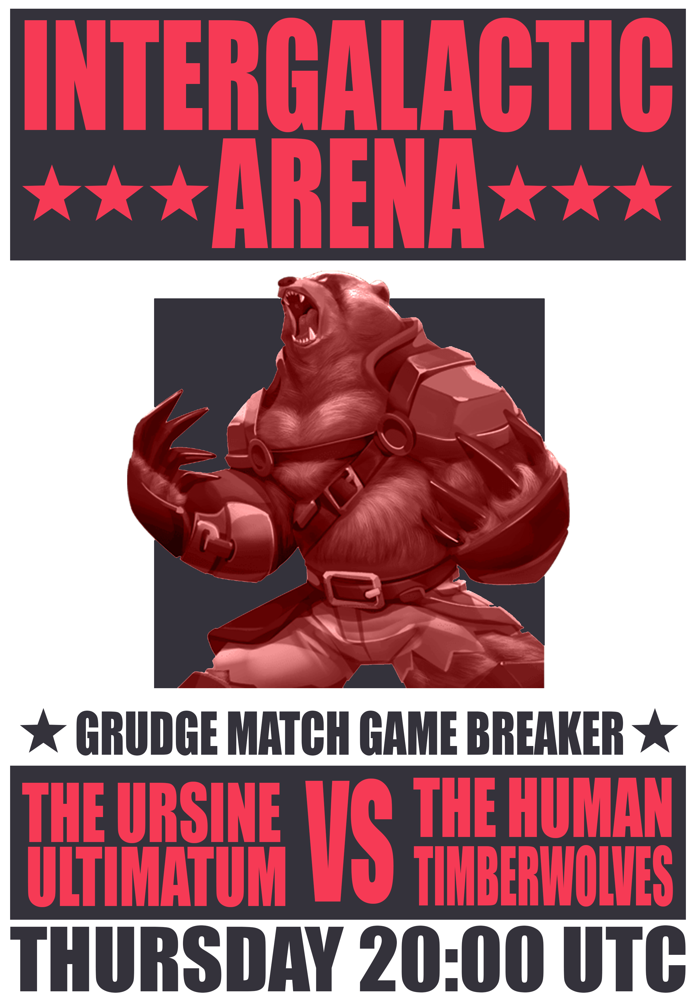
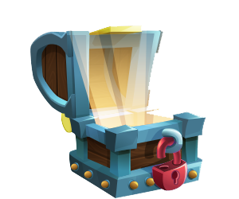
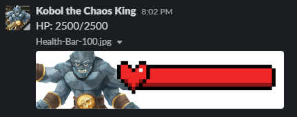
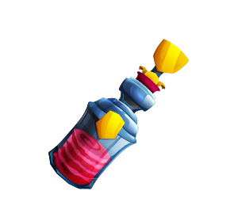
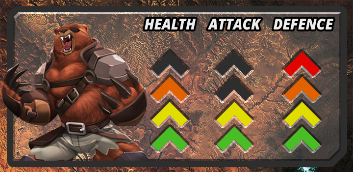

# Loot Raids

## **What are “Loot Raids?”**

 Loot Raids are monthly events where members of the community can come together and fight against "Bosses" to win premium prizes such as games consoles, technology and travel vouchers. 

## **How do I Play?**

To take part, players must purchase a "Raid Pass" for each individual Raid. These can be found in the Vault: [https://xhq.x-team.com/vault](https://xhq.x-team.com/vault)  

Once you have your Raid Pass, be sure to show up in \#raids channel in Slack at the Raid time \(usually 20:00UTC on a Thursday Night\).  
  
The Boss will be revealed and it's up to the Raiders to defeat them! 

To do this, the Raiders roll dice that are awarded to them by a bot in Slack. The higher the roll, the more damage they do to the boss.

Sometimes "Exploding Dice" will be activated! This means that for every Die result of 6 that a Raider rolls, they can roll another Die, resulting in more damage and the potential for some crazy numbers.

Once everyone has rolled for damage, the Boss will then take their turn and fight back by eliminating members of the raid! Normally they eliminate the person \(or people!\) who rolled the lowest damage in the group for that round.

Before the Raid, you can purchase Phoenix Stimulants from the Vault. If you find yourself a target for elimination, you can use this Phoenix Stimulant to stay in the fight! 

### **Use the command /raidrevive @user to use your purchased Phoenix Stimulant on yourself or another player.**

Once the Boss has eliminated the Raider\(s\) for the round, the surviving Raiders attack once more, rolling fresh dice and dealing more damage! 

This continues until one of two things happens: the Boss runs out of Health and is defeated, or the Raiders are all eliminated. 

## How do I win?

Once the fight is over, the damage totals for each surviving Raider are totalled up. 

The Raider that dealt the most damage wins the premium prize and the 4 runner's up are rewarded coins. 

## What's New for Season 5?

In Season 5 the Loot Raids themselves go down just as normal. But the week leading up to them is very special indeed. 

This time around, each House has one week to Level Up their own Boss to face off against the Raiders!

There are three separate statistics that can be Levelled Up during the course of the week:  
  
**Health:** Is the amount of Damage a Boss can take from Raiders. This is Levelled Up by meeting certain Steps Goals during the course of the week. The Boss starts with 10,000 Health and can be Levelled Up to 25,000 Health.

**Attack:** Is the number of Raiders that the Boss Eliminates each round. This is Levelled Up by meeting certain Workout Goals during the course of the week. It starts at Eliminating 1 Raider per round and can scale all the way up to 4 Raiders per round!

**Defence:** Is how good the Boss is at avoiding openings in its Defence. This reduces the number of times the Raiders are granted Exploding Dice during the Raid. It starts at 5 Exploding Dice rounds during the Raid and can be Levelled up to only grant 1.

## How do we win?

Once the fight begins, it plays out just like any other Loot Raid, with one key exception... **the Raiders have only 10 Rounds to Defeat the Raid Boss!** 

### **If the Raiders succeed in Defeating the Raid Boss...** 

* The opposing Houses win!
* Coins and premium prizes are given for the top damage dealers 
* The opposing two Houses gain bonus Resources to help them in the War of the NeXus. 

### If the Raid Boss lasts the full 10 Rounds...

* The Boss House wins! 
* Prizes are still awarded to the top damage dealers in the Raid as normal
* The House who Levelled Up the Boss gains a large stash of Resources to help them in the War of the NeXus. 

