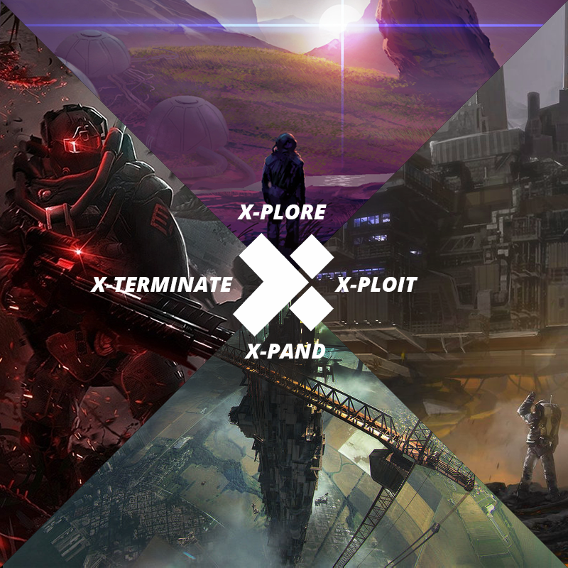
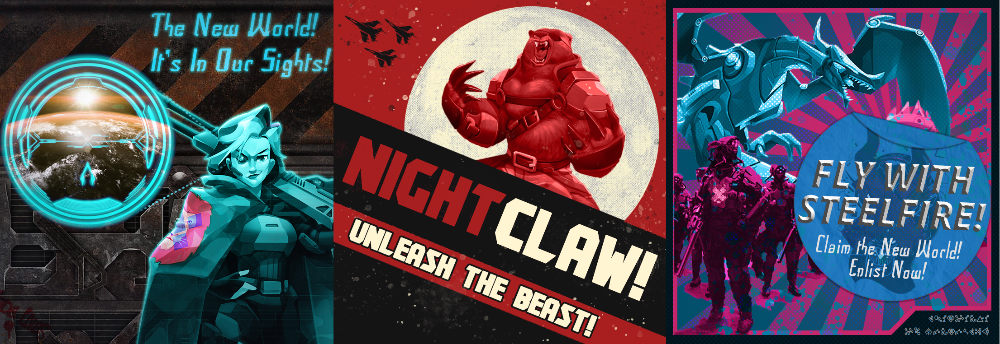
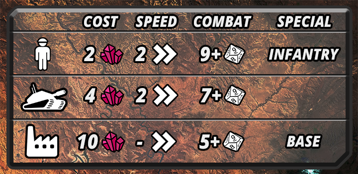

# War of the NeXus

## **What is the “War of the NeXus?”**

The War of the NeXus is a brand new metagame that will be running throughout X-Team’s Season 5. A grand struggle between the three Houses - Steelfire, Nightclaw and the Lions Pride - to claim dominance of a brand new planet in the X-Team universe.   



Over the course of three months, players will explore this wild planet, extract rare resources where they find them, expand their territories by constructing bases and defenses, and exterminate their opponents in fast paced dice based combat.   

Only one House can win. But what can you do to take part?

  
****

## **“I’m interested, but I don’t have a lot of time”**

That’s alright. Even if you don’t have any time to dedicate to the game, you can still take part in significant ways.   

* Be sure to sign up to one of the three Houses: Steelfire, Nightclaw or Lions Pride by sending a DM to @ElaineLithgow on slack. 
* Once you are aligned with a House, any bounty that you complete during Season 5 will automatically grant resources to your chosen House. These resources will be used by the Generals and play a vital role in securing victory for your house.
* Cheer on your House during rolloffs and other pivotal moments in the campaign.

## **“This sounds pretty cool! How do I step up my involvement?”**

If you have more time on your hands, you can do the following to get up to your elbows in the game.   

* Sign up to your House by sending a DM to @ElaineLithgow and get ready for a fight! 
* Join the private channel for your House \(contact @ElaineLithgow for an invite\). 
* Work with Generals to help plan out the metagame strategy. 
* Get involved with Loot Raids and VS events to secure additional resources for your house.
* Take part in combat rolloffs once a week to secure victory for your House

## **“I love the idea of this so much I want to take a key role in bringing out the best in this game!”**

It sounds like you would like to be a General! Generals are the strategic minds of the Houses, those responsible for making the tough calls! DM @ElaineLithgow if you’re interested in becoming a General. Each house will need a small number of Generals who will be responsible for:   

* Allocate resources for exploration, construction or combat. 
* Rally your house and never give up the fight. 
* Once a week, step forward and execute grand strategies that will change the face of the game. 

## 

## **THE RULES OF THE GAME**

Everything you see below here dives deep into the rules and mechanics of the Season long metagame “War of the Nexus”. Don’t worry, you only need to jump into these rules if you are a “General” or want to know more about how the game functions so you can take part in strategy discussions/etc.   
  
****

**Overview**

In “War of the Nexus” each House \(the Lions Pride, Steelfire and Nightclaw\) will fight over control of a vital area of the New World.   

To do so, they will gather Resources through various actions and use them to build bases and units to defend them.  

There are different kinds of units, some cheap and plentiful, others expensive but powerful! Some units have special abilities or limitations, for example: Standard soldiers cannot claim territory!   
  
As the game progresses, you will have opportunities to upgrade your Units too, boosting their stats or adding new abilities.    

At the end of the Season, the House with the greatest number of territories will win and claim the right to call the New World their home.  
  
  
  
****

**The Map**  

The map that we use for the game is pictured above. Every hex is a separate “Territory” that can be fought over and claimed.  The different kinds of hexes are highlighted below:  
****

<table>
  <thead>
    <tr>
      <th style="text-align:left"><b>Territory Type</b>
      </th>
      <th style="text-align:left"><b>Example Image</b>
      </th>
      <th style="text-align:left"><b>Purpose</b>
      </th>
    </tr>
  </thead>
  <tbody>
    <tr>
      <td style="text-align:left"><b>Home Territory</b>
      </td>
      <td style="text-align:left">
        
      </td>
      <td style="text-align:left">
        <ul>
          <li><b>The starting position for each house. </b>
          </li>
          <li><b>This territory generates a base amount of resources each week.</b>
          </li>
          <li><b>This territory cannot be lost or claimed by another house.</b>
          </li>
        </ul>
      </td>
    </tr>
    <tr>
      <td style="text-align:left"><b>Unclaimed Territory </b>
      </td>
      <td style="text-align:left">
        
      </td>
      <td style="text-align:left">
        <ul>
          <li><b>Any territory that has no units or bases within it. </b>
          </li>
          <li><b>They generate no resources and do not prevent movement.</b>
          </li>
        </ul>
      </td>
    </tr>
    <tr>
      <td style="text-align:left"><b>Claimed Territory</b>
      </td>
      <td style="text-align:left">
        
      </td>
      <td style="text-align:left">
        <ul>
          <li><b>A territory with one or more units within it.</b>
          </li>
          <li><b>These generate Resources for the House which has the units/bases within it.</b>
          </li>
          <li><b>Other Houses cannot move through these hexes without resolving combat.</b>
          </li>
        </ul>
      </td>
    </tr>
    <tr>
      <td style="text-align:left"><b>The NeXus</b>
      </td>
      <td style="text-align:left">
        
      </td>
      <td style="text-align:left">
        <ul>
          <li><b>A special resource rich territory in the centre of the map. </b>
          </li>
          <li><b>This territory  generates a large amount of resources for the house that claims it.</b>
          </li>
        </ul>
      </td>
    </tr>
  </tbody>
</table>

**Turn Order**

Every week during the Season will follow the turn order listed below.   
****

* **Tuesday Action Phase!:** Every Tuesday the Houses will execute the actions decided upon by the Generals of each House. These actions will be public! And can be any combination of the below:
  * **Move Units:** Generals can move Units from one Territory to another
  * **Construction:** Generals can construct units of bases as shown in the “Resources” section
  * **Combat:** Any time two Houses end their Action Phase occupying the same Territory, Combat takes place \(see “Combat” section\).
* **Resource Generation:** Once the Action Phase is resolved, each House will generate resources from their Claimed Territories and Bases \(as shown in “Resources Below”\). 
* **Planning Phase:** After the Tuesday Action phase, the players then have the rest of the week to retreat to their private channels, gather additional resources through Bounties/events and plan their next move.
* **Repeat!:** This cycle continues until the end of the season!

**Resources**  

Resources are the lifeblood of your House. They are mined from the planet itself and can be used to build Bases or construct Units.  
****

**Resources can be gained in the following ways:**  

* **Home Base:** Your home base always generates \(10\) resources every Tuesday.
* **Bounties:** Every time a member of the House completes a bounty, their House is awarded resources on a 1 Coin = 1 Resource basis.
* **Claimed Territory:** Each Claimed territory generates \(3\) resources every Tuesday.
* **The NeXus:** The controlling house gains an additional 10 resources every Tuesday. 
* **Bases:** Each base generates an additional \(3\) resources every Tuesday.  ****
* **Events:** Certain seasonal events, such as loot raids and VS events, can grant Resources as rewards.
* **Trading:** Houses can trade resources whenever they wish! \(useful if you need to pool resources to face a house that has become too big\).

**Resources can be spent to:**  

* **Build Bases:** Bases can be constructed in any claimed Territory.
* **Build Units:** Units can be built, spawning at any of your Bases or your Home Territory. Units cannot move on the turn that they are built.

**Units**

Units are what you use to explore, build and fight in War of the NeXus. There are various types of Units available \(shown on your House Unit Card\).   

Each Unit has the following statistics:   

* Resource Cost: The number of resources required to build one of these units.
* Speed: How far this unit can move each turn \(measured in Territories/Hexes\).
* Hit Chance: The result needed on a D10 roll to “Hit” in combat. \(Lower is better!\)
* Special Abilities
  * Infantry: While strong combatants, foot soldiers are not enough to hold a position on their own. These Units cannot claim Territories on their own.
  * Base: Bases take in resources from the surrounding area and also offer a strategic defensive position. Bases cannot be the target of attacks in combat, and are only destroyed when all other Units from the Base’s house are destroyed. Bases cannot be set up in a territory adjacent to another base. \(There must always be a territory without a base in it on each side before you can build a base.\)
  * \(And More!\): Certain units can be upgraded or special units gained through Seasonal Events that have additional special abilities. So keep an eye out!

**Combat**

When the time comes and weapons are drawn, each House will need to know how to fight in combat!   

Any time that Units from two or more houses end their Action phase in the same Territory, combat will break out!  
  
To resolve the combat \(and see who comes out alive\) follow the steps below:  

* **Roll To Hit:** Each side rolls a D10 for each Unit they have committed to the territory. They roll these dice, and compare them with the “COMBAT” score indicated on the unit card. 
* **Take Damage:** Each hit from the previous stage causes 1 point of damage to the opposing House’s Units. Each House chooses which of their Units take damage and are destroyed. 
* **Retreat or Continue Fighting:** After a round of Hits and Damage has been taken, each house involved in the fight has the choice of continuing to fight \(in which case go back to “Rolling to Hit”\) or Retreating. If a House retreats, they move to a connected empty Territory and the combat is over. 
  * A retreating force does not claim the Territory it is on, so it does not generate resources.
  * If there are no empty Territories to retreat to, the Units must continue fighting. 
* **Destroy Bases:** Once combat is resolved, the winning side claims the territory, destroying any Bases from opposing Houses in the process.

**The Winner**

At the end of Season V, the victorious House will be the one that holds the most territories.   

