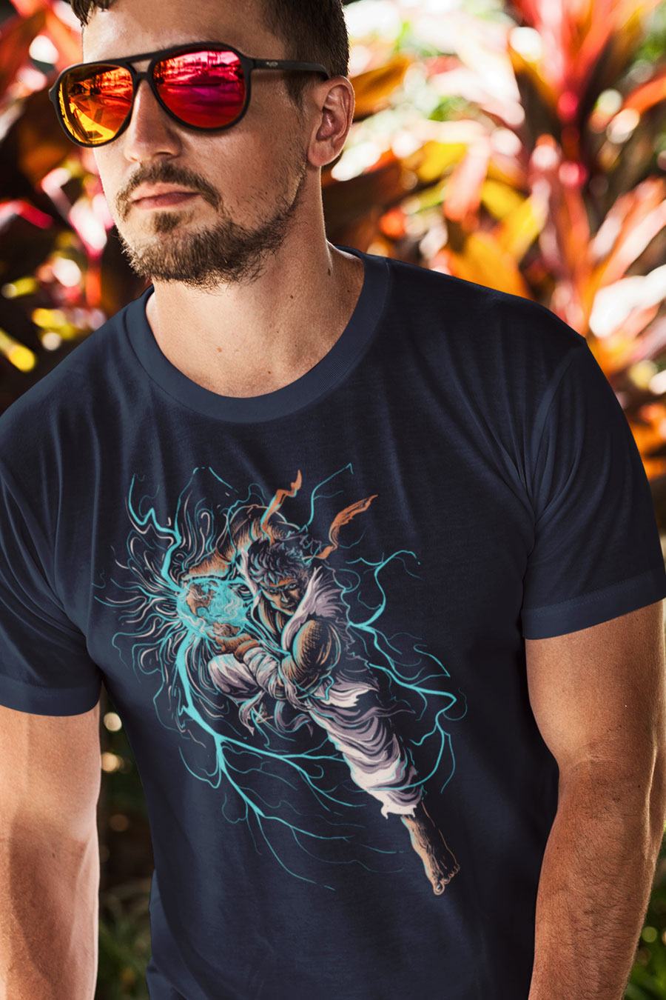
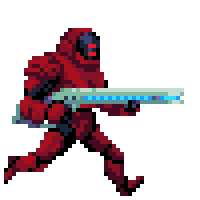

# Guide

## Introduction

Welcome to **Season 6:** _**NOT DONE YET \(PT. II\).**_



> "You can let this be the year you put on pause, or the year you discovered what you're capable of."

We may never experience a moment like this in our lives ever again. A moment filled with so many new challenges that force us to grow in such a short period of time. 

We may never have a greater opportunity to be not just a human being, but a human becoming. To rise up from months of demotivation and boredom and uncertainty and stand tall and say "I'm not done yet. I'm not done growing as a person, as a developer, as a photographer, as a gamer, as a creator, as a griller, as someone who only knows one direction to go in -- _forward."_

You can see this moment in history as a moment that you sat idly by as others got creative with their lives in ways they never had before. Or you can join the movement.

The ball is in your court.

Poet Leslie Dwight summed up 2020 perfectly in this [Instagram](https://www.instagram.com/p/CA_CXcBp7Rg/?utm_source=ig_embed) post:

> What if 2020 isn’t cancelled?⁣ 
>
> What if 2020 is the year we’ve been waiting for?⁣ 
>
> A year so uncomfortable, so painful, so scary, so raw — that it finally forces us to grow.⁣ 
>
> A year that screams so loud, finally awakening us from our ignorant slumber.⁣ 
>
> A year we finally accept the need for change.⁣ Declare change. Work for change. Become the change. 
>
> A year we finally band together, instead of⁣ pushing each other further apart.⁣ ⁣ 
>
> **2020 isn’t cancelled, but rather⁣ the most important year of them all.”**
>
> -Leslie Dwight

###  **2020 is a challenge to prove that we are truly** _**Not Done Yet**_**.** 


 **If this is your first time participating in a Season at X-Team**, Seasons are 3 month experiences crafted to help you learn, grow and explore. Each theme has its own theme and accompanying Events, Bounties, Collectibles, and more which you'll find out more about below.


## Bounties

We left behind an incredible amount of motivation before COVID-19 arrived, and along with that went projects and goals. Use this season's Bounties to help you regain that motivation and get back to those goals. As Isaac Serwanga said, "This is our time," so make the time and make it happen.

Bounties are optional personal challenges that you can take part in every season. They are like the achievements or trophies in your favourite video game, but in this case, the game is your life. 

Every season we offer up a brand new list of Bounties to challenge and excite you. They range from club activities or fitness goals, to personal growth and enjoying the little things. Each month we also offer up a new collection of limited time bounties for clubs, to keep things fresh. Below are just two of the Bounties on offer at the beginning of Season 6.  

 **Not Done Yet:** Return to a hobby or project that you have neglected or put on the backburner for some time. Make some progress and share it in \#Unleash

If you miss going to concerts, but you're stuck at home in your country, don't let it be an excuse. You're not done yet, remember?

**You Had to Be There:** Recreate the concert experience at home by watching a recording of a concert you haven't been to. Turn it up to 11 and go crazy. Share the experience in \#club-music.

You can "Favourite or "Hide" Bounties depending on your interests. You will even be reminded of your Favorited bounties by a Slack Bot on occasion, to help you seize the day.

Every time you complete a Bounty, you will gain coins. The harder the bounty, the more coins you earn. These can be used in the Vault to purchase lots of different kinds of Loot. From hats and notebooks to t-shirts and donations to charity, you should always have something to put your coins towards. New items are added to the Vault regularly, so be sure to check back often so you don't miss out on something awesome. [https://xhq.x-team.com/vault](https://xhq.x-team.com/vault)


Consider using [**Unleash+**](http://xhq.x-team.com/unleash) ****this season to help you get out and explore nature, whether it's our new Bike Rental category or new running shoes, there are plenty of options to keep you energized both inside and out of the house.


## The Vault

You can earn coins or stars by participating in [Events](../season-5-new-world./guide.md#events) or completing [Bounties](../season-5-new-world./guide.md#bounties). These let you purchase collectibles or donate to causes in [The Vault.](http://xhq.x-team.com/vault)


### This Season's Launch Collectibles


**Also coming this Season to The Vault:**

* A secret Community Collab item
* Our first parody collectible shirt.
* **Vault Comeback:** The community will vote together on bringing back into The Vault 1 item from previous seasons.
* **X-Team Radio**'s first collectible shirt, featuring DJ Sonic.
* And more!

## Unleash+

[Unleash+](http://xhq.x-team.com/unleash) is your $2,500 per year budget to spend toward activities and gear that energize you. Use it this season to help you rise up from demotivation in your quarantine dungeon and capitalize on life and your passions.

We've also added two new categories you might enjoy:

**Sustainable Products:** $100/mo toward any products that will help you live and work in a way that helps you reduce your carbon footprint, support the environment or reduce consumption of animal products.

**Bike Rentals:** $100/mo toward helping you get out and live active while also exploring your surroundings via any kind of bike rental.

**Have an idea for another category to add this Season? DM @ryanchartrand on Slack!**

## War of the Ages

War of the Ages is a new Metagame that will run for the length of Season 6. Featuring a time hopping, resource gathering strategic battle filled romp of silliness and fun. 

Players sign up to a House, either the Lions Pride of House Nightclaw. From then on, every Bounty they claim also grants Resources to their House.   
  
These Resources are collected throughout the month and spent by volunteer House Generals to buy Units in the ludicrous battle Simulator TABS: Totally Accurate Battle Simulator. 

At the end of each month, we will host three battles using the Units purchased by the Generals. Each victorious battle grants Victory Points to the winning House. Then we hop through time to another period and do the same thing all over again.   
  
From cave-men to knights to pirates, you never know what's coming up next. For more information see the War of the Ages page in this Guidebook.    

## Events

**VS Race:** This is an event where the two Houses \(Nightclaw and the Lion's Pride\) face off against each other in a 24 hour long team-based competition. Each House collects steps using their step tracker of choice, post the steps to the \#vs channel, and the team with the most steps at the end of the 24-hour period wins the race, including coins in their pocket and resources for War of the Ages.  
  
For examples of past VS Events and to take part in others, visit:  [https://app.slack.com/client/T0257R0RP/CGK10CSLU](https://app.slack.com/client/T0257R0RP/CGK10CSLU)   
  
  
**The Arena:** This is the first-ever Slack-based battle royale game. The game is broken into rounds where you'll have the ability to choose your action.

Will you search for weapons? Or go hunting? Or hide? Or look for health to recover? This is sure to be our most intense realtime Slack-game yet.

#### Best of all, whoever is the last hunter standing will win the exclusive new X-Pack backpack:

  
**Fireside:** These events are your opportunity to chill out, chat and play some games with the X-Team Community.  

  
Firesides take place over a big Zoom call, where we can all get some face time to talk about recent news or upcoming events, exciting developments or anything that comes to mind. Then we play some games to win coins and have some laughs.   
  
They are relaxed affairs, with no signups required, no camera needed and freedom to come and go as you please.    

**X-Summit 2020:** 



Last year's X-Summit is certainly hard to beat considering we took over a castle and had one of the most memorable weekends ever.

And while we can't gather in-person this year, it doesn't mean we still can't try to top last year's event. And for the past months, we've been hard at work at doing just that.

This year's X-Summit will be entirely online, meaning anyone can participate.

* An opening ceremony unlike anything we've ever done
* Big announcements we've been waiting to drop
* All-new House VS competitions
* Open bar Zoom parties
* Tons of side parties -- poker, board games, live DJ, cook together, the list goes on...
* The Box returns...at everyone's doorstep.
* And more...

\*\*\*\*

### **More events will be posted here as the season progresses.**

## Featured Causes

\*\*\*\*[**Save the Children COVID-19 Fund**](https://www.savethechildren.org/us/what-we-do/emergency-response/coronavirus-outbreak)\*\*\*\*

More than 1 billion children are now out of school. Child poverty is rising. Refugees living in over-crowded camps and those living in conflict will be hit the hardest. They desperately need our help to address the immediate and long-term threats of COVID-19. We must act now to protect a generation. Save the Children has been on the ground protecting children and families from COVID-19. Their teams are working around the clock to ensure the health, safety and psychological well-being of children around the world are protected.

\*\*\*\*[**Cookstoves for Uganda**](https://bit.ly/2UVICjl)\*\*\*\*

Join our \#FightingChance campaign and help us offset our 284 tonne carbon footprint. We absolutely love this project because it not only reduces charcoal use and deforestation in Uganda each year, it helps families save money and spend more time with loved ones. Learn more here: [https://bit.ly/2UVICjl](https://bit.ly/2UVICjl)

\*\*\*\*[**Campaign Against Homophobia \(Poland\)**](http://kph.org.pl)\*\*\*\*

Poland is an X-Team hub, but it has also regions that are violent and discriminatory toward the LGBTQ+ community. $50 will go to Kampania Przeciw Homofobii \(kph.org.pl\) which helps prevent that violence and has helped reduce it by over 30% in the last 15 years. Their goal is to make Poland diverse and that all LGBT people, their families and loved ones, can feel safe and have equal opportunity. Help support this great organization.

\*\*\*\*[**Casinha \(Brazil\)**](http://facebook.com/casinhaacolhida)\*\*\*\*

Brazil is one of X-Team's main hubs, but it's also one of the least safe places to live if you're LGBTQ+. Casinha is a safe house for young LGBTQ+ people who are vulnerable to violence or discrimination. It's also a great cultural center open to all. Help give the Brazilian LGBT community a safe place to go. Learn more at: facebook.com/casinhaacolhida

## 

