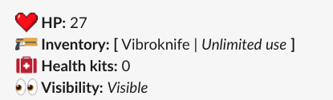

# The Arena

## How it Works

You start every game with 100hp, no weapons and nothing in your inventory but the will to fight.

From here, the game is broken into a series of rounds. Each round, you can execute **one** of the actions listed below:

### Search for Weapons \(/arena-searchforweapons\)

There are lots of different weapons in the arena of varying rarity. Each weapon can deal a different amount of damage and has a different number of times it can be used before it runs out of ammo.

By using this command, you will spend your round searching for a weapon in the Arena.

 The weapons list is a secret, you'll have to learn on your own which weapons are best in which scenario.

You will be visible, so other Hunters can damage you.

### Hunt \(/arena-hunt\)

Now you have a weapon, it's time to get hunting! Use the /arena-hunt command to track down and deal damage to other arena players.

If you only have 1 weapon, the slack bot will automatically use that weapon for you until it runs out of ammo. If you have more than one weapon, you'll will be prompted to choose which weapon you want to hunt with from a drop down menu. This allows you to use or save your higher rarity weapons until the right time. 

Note that each weapon has a set number of uses \(ammo\). Once you run out of ammo, that weapon is gone. You'll need to search for more weapons to get back to hunting.

Once you have chosen which weapon to hunt with, you will spend the round looking for someone to attack. Your target is chosen at random from all players that are not Hiding \(see below\).   
  
If you hit, you will deal damage to your chosen target, potentially eliminating them from the game. However, your attack could also miss! So be sure to pick your weapons and timing carefully.

While hunting you will be visible, so other Hunters can hunt and damage you too.

### Hide \(/arena-hide\)

You will spend the round hiding and will not be visible, meaning you can't be damaged.

The only time you cannot hide, is if the Ring of Fire closes in. This is a random event that can shake up the arena and force those bush monsters to leave their hiding spots. 

### Search for Health \(/arena-searchforhealth\)

You will spend the round looking for a health pack. If you find one, it will be added to your inventory, but you it is not guaranteed!

You will be visible when searching for health, and could get damaged.

### Revive \(/arena-revive\)

If you have a health pack in your inventory, you can use the command /arena-revive to heal yourself for +50hp. You can even heal or revive other players if you're feeling generous by using /arena-revive @playername

You will be visible while healing, so can be hunted and damaged by other players.

### Run to an airdrop \(/arena-runtoairdrop\)

Sometimes a valuable airdrop will be dropped into the arena \(Indicated by a post in the channel.\)

If there is an active airdrop, you will run to the air drop for your shot at a Legendary weapon or a Health Kit. You must have a weapon to run to an air drop as you may encounter another player also running there and will need to fight.

Only one player will emerge from the round with the contents of the air drop.

## Last Hunter Standing

The last hunter standing will be awarded what all Hunters dropping into The Arena need: The X-Pack Backpack.

The finale of The Arena in Season 6 will include a special Legendary item inside the backpack.

## Bosses and Special Targets

In some Arena battles a Boss or Special Target may enter the fray. These can be tough as nails hunters with high powered weapons, or walking loot pinatas just asking to get eliminated.

The player who deals the killing blow to a Boss or Special Target will be rewarded with a special prize. This may be Coins, House Resources or even premium prizes, so keep an eye out for them. 

## Bonus tip

If you ever want to know your current inventory, health or other information, use **/arena-status.**

## How to Join

If this sounds like fun to you, visit the Vault to purchase an "Arena Pass" for 1 coin to secure your spot in the Arena. Arena Passes are posted 1-2 days before an event. [https://xhq.x-team.com/vault](https://xhq.x-team.com/vault) 

