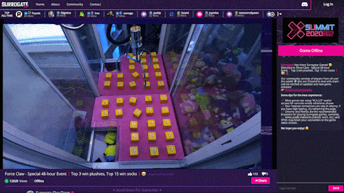
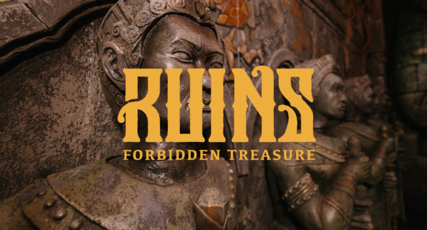
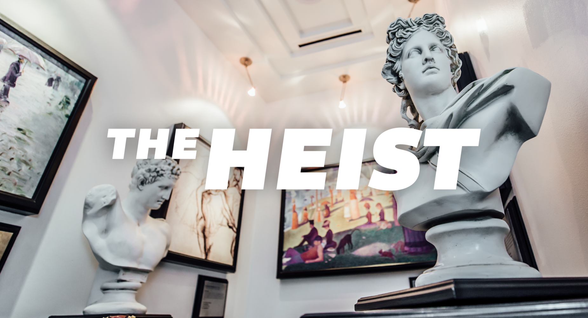

# X-Summit 2020

The X-Summit, normally held in-person at an [epic location](https://www.youtube.com/watch?v=LD-k9hY9E-A), is going all-online this year for a week-long event unlike any we've ever put together.

The tradition of the X-Summit is to come together **to witness the unexpected, to do things we've never done, to behold and bear witness to moments that will forever be uniquely ours.**

And this year is no different. We want to help you summon more energy than ever before in 2020. To break your routine and crack open your mind again from a new experience.

[For all breaking news and updates, check the \#x-summit-2020 channel on Slack.](https://app.slack.com/client/T0257R0RP/C017JFT1Y8H)

Here's a first-look at what you can expect:

## **Tuesday \(Sept. 1\)**

### **Opening Ceremony**

**20:00 UTC -** This year's Opening Ceremony will kick things off with a show unlike any we've ever done before. Make sure to tune in LIVE for an all-new experience.

### **The \(Un\)Box\(ing\)**

**20:30 UTC -** Don't forget: **Do** **not open The Box** until we all open it together following the Opening Ceremony.

Haven't signed up to receive The Box yet? [Grab yours here.](https://forms.gle/2GmDyvE8i8YFxNU26)

## **Wednesday \(Sept. 2\)**

### **The Claw**

**18:00 UTC:** It's first come, first serve at playing The Claw, which lets you remotely control a REAL claw machine as you attempt to pick up miniature versions of The Box, each with their own \(potentially Legendary\) reward inside. Such rewards could include an Oculus Quest, gift cards, $300 in tech gadgets, and more. Check [\#x-summit-2020](https://app.slack.com/client/T0257R0RP/C017JFT1Y8H) when the full list is released.

### **Virtual Escape Rooms**

**RUINS: Forbidden Treasure**  
You’re on a relaxing aerial tour of a remote jungle when everything suddenly falls apart. You’re stranded at the foot of ancient and mysterious temple ruins – home of a massive fabled treasure. Adventure has come knocking and the treasure could be yours for the taking. Fortune favors the bold. Will it favor you?  
  
_Last spots remaining!_  
****👉 **18:30 UTC:** [**Reserve your spot here.**](https://forms.gle/s8fYo8HedwfvJ1Fz5)

**The Heist \(Escape Room\)**  
Your world-class espionage outfit has landed you inside a prestigious art museum. A recently stolen masterpiece is presumed hidden within the office of the museum’s egotistical curator, Vincent Hahn. With the help of your intelligence agent on the outside, you have one hour to find your way into Hahn’s office, recover the painting, and slip away before Hahn returns.

👉 **01:00 UTC:** [**Reserve your spot here.**](https://forms.gle/1nK4xxYvcfFTfejUA) **\(Wednesday night/Thursday morning\)**

\*\*\*\*

## **Thursday \(Sept. 3\)**

### **VS: Steps Championship \(Nightclaw vs. Lions\)**

Each year at the X-Summit, **VS: Steps Championship** is the 'World Cup' of VS events. 

Last year's champions were House Wolfpack after a controversial step count. But with House Wolfpack no longer active after losing in Season 4, the championship is now vacant and up for grabs.

Compete for your House, earning points by tracking your total steps and posting them to \#vs. Use any step tracker.

The House with the most steps after 24 hours win the Championship and **will earn their House's exclusive X-Summit 2020 Championship t-shirt:**

### **Vault Drop**

The final Vault drop of Season 6 will arrive on Thursday, featuring a design from community member Oliver Diaz, brother of Ariel Diaz. You'll want to catch this one before its limited run is gone. It also marks the last item of the past decade's collection!

## **Friday \(September 4\)**

### **The X-Bar \(Open Bar\)**

One of the best parts of any X-Summit gathering is always the bar scene, and we're looking to recreate those vibes despite being apart. 

**Drop in/out of multiple Zoom bars throughout the day:**  
  
**10:00 UTC:** Pub Down Under - Australia + Asia.

**15:00 UTC:** Drawful Pub - Play the hilarious [Drawful](https://www.youtube.com/watch?v=1VwwkfhZYCI).

**16:00 UTC:** The Barcade - A 'Power Hour' competition of 6 arcade games back-to-back.

**17:00 UTC:** Late Night NSFW Bar - Anything goes.  
  
**22:00 UTC:** Drawful Pub - Play the hilarious [Drawful](https://www.youtube.com/watch?v=1VwwkfhZYCI).

**23:00 UTC - The Heist \(Escape Room\)**  
Your world-class espionage outfit has landed you inside a prestigious art museum. A recently stolen masterpiece is presumed hidden within the office of the museum’s egotistical curator, Vincent Hahn. With the help of your intelligence agent on the outside, you have one hour to find your way into Hahn’s office, recover the painting, and slip away before Hahn returns.

👉 [**Reserve your spot here**](https://forms.gle/9feQ6akLwEADCpC39)\*\*\*\*

**01:00 UTC:** Late Night NSFW Bar - Anything goes.  

👉 **Drinks are on us**, simply reimburse via Unleash+ any beverages/beers/liquors/etc. you bring to the X-Bars.

## ⭐ **Exclusive Star Bounty**

Earning a ⭐ **Star** is a rare opportunity, as 1⭐ gets you _**any 1 item from**_ [_**The Vault.**_](http://xhq.x-team.com/vault)_\*\*\*\*_

To earn a ⭐ during the X-Summit, you must follow in the tradition of the X-Summit by pushing yourself outside your own box:

 **X-Summit Week:** _**Do something you've never done before, and share your photo proof in \#x-summit-2020.**_

Play that game you've never played. Watch that movie you've never watched. Cook that dish you've never cooked. Hike that trail you've never hiked. Learn what you've never learned. Just _keep moving forward._

**Any of the events listed above** count as well if they are something you've never done before. You might even consider using your [Unleash+](http://xhq.x-team.com/unleash) to book an [Airbnb Online Experience](https://www.airbnb.com/s/experiences/online), such as [learning how to draw Manga](https://www.airbnb.com/experiences/1681963), or learning about [Sake](https://www.airbnb.com/experiences/1671474), [Mezcal](https://www.airbnb.com/experiences/1682923) or [Irish Whiskey](https://www.airbnb.com/experiences/1691320). Or a [Coffee Masterclass](https://www.airbnb.com/experiences/1655017), or how to [cook Cape Malay Curry \(South African dish\)](https://www.airbnb.com/experiences/1664105).

