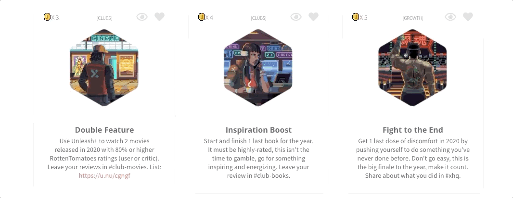
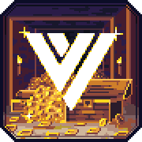
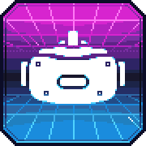
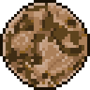

# Guide

## Introduction

Welcome to **Season 7:** _**FIGHT TO THE END.**_



> "_**There's a part of us that wants to know what else 2020 has to offer; to see what another dose of discomfort can awaken within us.**_"

Here we are, exhausted beyond our limits after 8 months of endless emotions, endlessly reinventing our lives, endlessly living in constant discomfort. When everything feels endless, **we are collectively losing motivation, ready to just coast to the holidays.**

But there's an alternative: to see what else 2020 has to offer. **To not crawl your way to the finish line, but to cross it proud.** To finish strong. To keep the momentum going and let the discomfort awaken something within you one last time this year. We may never be in such prime conditions for growth ever again.

There's only one way to take that alternate route, however: **we're going to need serious energy boosts to rebuild the momentum**. We must fight against burnout with every day that remains. We must make time for more breaks. We must find energizing moments ahead of us that will slingshot us forward. And once re-energized, we must embrace the discomfort one last time to see what it brings out of us.

This Season is the beginning of a new chapter in many ways. Everything new we've come up with was the result of us actively fighting off the burnout, getting re-energized, and then embracing all of the discomfort that innovation comes with. Take this Season's new direction as inspiration that there is still more you can awaken in yourself in these last 65 days.

###  **Finish Strong. Finish Proud. Fight To The End.**


 **If this is your first time participating in a Season at X-Team**, Seasons are multi-month experiences crafted to help you learn, grow and explore. Each theme has its own theme and accompanying Events, Bounties, Collectibles, and more which you'll find out more about below.


## Bounties

Bounties are personal challenges that you can take part in every Season. They are like the achievements or trophies in your favorite video game, but in this case, the game is your life. 

As Season 7 serves as Early Access to our 2021 Community, we've made some groundbreaking new iterations, notably: **Legendary Bounties** and **Create a Bounty.**

### **Legendary Bounties**

These special seven are the flagship Bounties of the Season: they pay the highest reward \(4-5 coins\) and are the most epic to have on your board thanks to their beautiful designs that stand out.

We wanted to bring back the excitement of new Bounties by putting in the effort to make our featured Bounties look truly legendary. We hope you enjoy them, check them out on [**the Bounties page.**](https://xhq.x-team.com/bounties)\*\*\*\*

**How Bounties Work:** Every time you complete a Bounty, you will gain coins. The harder the bounty, the more coins you earn. These can be used in [**The Vault**](https://xhq.x-team.com/vault) to purchase different kinds of Loot, from hats and notebooks to t-shirts and donations to charity, you should always have something to put your coins towards. New items are added to the Vault regularly, so be sure to check back often so you don't miss out on something awesome.


Consider also using [**Unleash+**](http://xhq.x-team.com/unleash) ****this season to help you complete Bounties.


## Create a Bounty

In Season 7, we're releasing a game-changing feature into Early Access in November: **the ability to create your own Bounty.**

We've purposely left the board a bit empty to make room for your creativity. Once launched, you'll be able to create your own Bounty for all to enjoy, and most importantly, allow you to customize your board to contain energizing moments that _**you**_ are looking forward to the most.

More Information:

* A custom Bounty can be made private
* X-Teamers can create **up to 5 Bounties per Season**
* **All X-Teamer Bounties will be worth 1 coin**, BUT we will be actively promoting good Bounties to be worth 2-3 coins, so if you want a coin to be high-value, make it a good one ;\)

### Missions

We're also introducing Missions, which are sets of Bounties with an exclusive reward once completed. The first Mission will challenge you to make your own Bounty, favorite someone else's, and then complete someone else's Bounty.

## House Perks

Also included in Early Access will be **House Perks,** which finally give Houses something other than glory to compete for.

There will be a variety of Perks released over time, but here are the Launch Day Perks:



**Custom Vault Gear \(100 Luna\)**  
_Get a custom branded item for your House added to The Vault._




**Oculus 2 Sweepstakes \(100 Luna\)**  
_Your House gets a sweepstakes for an Oculus 2 \(1 winner\). Your House decides how the winner is determined._




**X-Team Radio Theme \(100 Luna\)**  
_Your House decides the next X-Team Radio background theme._




## **Introducing: Luna**

Each House Perk costs **Luna**, a new currency just for Houses. Luna is earned a few ways:

* **Events:** Placing top scores in The Arena or VS, for example, will help your House earn Luna.
* **Gambling:** Houses can bet Luna against other Houses on the outcomes of Events.
* **Duels:** A House can challenge another House to a Duel in The Arena, 5v5. The Luna earned is based on a wager.

## Create a House

This Season also introduces the ability to form your own House together, letting you not only get your own House sigil, but also compete in Events together and earn Luna to spend on House Perks.

For more on this, check out "[Create a House](create-a-house.md)".

## The Vault

You can earn Coins or Stars by participating in [Events](../season-5-new-world./guide.md#events) or completing [Bounties](../season-5-new-world./guide.md#bounties). These let you purchase collectibles or donate to causes in [The Vault.](http://xhq.x-team.com/vault)


### This Season's Launch Collectibles


**Expect Vault Drops every Tuesday this Season, including:**

* Tees inspired by movies coming out this season, as well other limited edition tees.
* New evergreen X-Team gear \(hoodies, jerseys and shirts\)
* Legendary Vault drop for The X-Mas Party 2020 on Dec. 17.
* And unlock more via House Perks.

## Unleash+

[Unleash+](http://xhq.x-team.com/unleash) is your $2,500 per year budget to spend toward activities and gear that energize you. Use it this season to help you rise up from demotivation in your quarantine dungeon and capitalize on life and your passions.

We've also added two new categories you might enjoy:

**Wifi Router:** $100/mo toward a Wifi Router that helps you maintain a quality connection for work and all you need to stay energized.

**Team Happy Hour:** $100/mo toward having a virtual Happy Hour with your team. Each member can utilize this category together as a way to bond and re-energize.

**Podcast Gear:** $100/mo toward any gear or apps you need to host your own podcast as a way to keep learning, growing and creating.

**Have an idea for another category to add this Season? DM @ryanchartrand on Slack!**

## Events

X-Team Events are one of the greatest ways to get a boost of energy during your week. Now, more than ever, we need these boosts to help us Fight To The End. Check out the many new events we have in store for you below and make sure to subscribe to the [Community calendar](https://calendar.google.com/calendar/u/2/r?cid=Y29tbXVuaXR5QHgtdGVhbS5jb20).

\*\*\*\*[**Subscribe to the X-Team Community calendar on your Google calendar.**](https://calendar.google.com/calendar/u/2?cid=Y29tbXVuaXR5QHgtdGVhbS5jb20)\*\*\*\*

### **The Arena: Undead**

The first-ever Slack-based battle royale game returns this Season with all-new features and surprises, starting first with our "Undead" edition for Halloween. Will you search for weapons? Or go hunting? Or hide? Or look for health to recover? This is by far our most intense realtime Slack-game yet.

\*\*\*\*[**Add to your Calendar**](https://calendar.google.com/event?action=TEMPLATE&tmeid=MGpxNm1tZ2ExbTJkY3ZtOXZjM2dkOGczam4gY29tbXVuaXR5QHgtdGVhbS5jb20&tmsrc=community%40x-team.com)\*\*\*\*

\*\*\*\*[**Learn how to play The Arena**](../season-8-commit./the-arena.md#how-it-works)\*\*\*\*

\*\*\*\*[**Join \#the-arena on Slack**](https://app.slack.com/client/T0257R0RP/C015XHF3150)\*\*\*\*

Last hunter standing will win the exclusive X-Pack backpack:

### **The Arena: Fight To The End.**

The Arena will return again on Nov. 26th for the first-ever Teams Arena battle**, allowing all of the Houses of X-Team to face off against each other at one time**.   
  
****[**Add to your Calendar.**](https://calendar.google.com/event?action=TEMPLATE&tmeid=NmdncnF1bTQxYmo4bGd2NHY2bmpjNmVzMWwgY29tbXVuaXR5QHgtdGVhbS5jb20&tmsrc=community%40x-team.com)\*\*\*\*

### **VS: PvP**

In Season 7, we're introducing **VS: PvP, the first VS where we'll host 1v1 matches between Houses.**

The Houses will come together and decide on what competitions \(chess, Starcraft, running, etc.\) they are willing to compete on, and from there, matchmakers will arrange for 1v1 matches, with Luna going to the winning Houses.

This is a great way to cheer on and support your fellow House members as they compete for your House's success.

### **VS: Mario Kart Home Circuit**

We've teamed up with our friends at Surrogate.tv again for an exclusive and very special edition of VS, as we jump into real-life Mario Kart cars on a real, custom-built track. Thanks to the help of Mario Kart Home Circuit and some Surrogate.tv magic, this is a very rare opportunity indeed.

Race winners will earn coins for themselves, and Luna for their House.

[**Add to your Calendar**](https://calendar.google.com/event?action=TEMPLATE&tmeid=NG9kNDdwdWgzNjg2Y2M2dm5ldWhxY2R1c2UgY29tbXVuaXR5QHgtdGVhbS5jb20&tmsrc=community%40x-team.com) **\|** [**Join \#vs on Slack**](https://app.slack.com/client/T0257R0RP/CGK10CSLU) 

**Practice ahead of time here**: [https://www.surrogate.tv/game/mariokartlive](https://www.surrogate.tv/game/mariokartlive)   
**Watch the epic making-of here**: [https://www.youtube.com/watch?v=EqmpQuUdNfo](https://www.youtube.com/watch?v=EqmpQuUdNfo)   

### **VS: Strava**

Every Season comes with 1 competition to rule them all -- **VS: Strava**, formerly known as VS: Steps. 

This is a 24-hour battle between the Houses of X-Team to see **who can rack up the most distance in Strava**. Every step counts, as Luna & Coins will be awarded to Houses with the **largest sum totals as well as to individuals with the largest totals.**  
  
**How to participate:**

1. Join [\#vs on Slack](https://app.slack.com/client/T0257R0RP/CGK10CSLU%20) to stay updated
2. Join our Strava Club on Strava: [https://www.strava.com/clubs/496475/](https://www.google.com/url?q=https%3A%2F%2Fwww.strava.com%2Fclubs%2F496475%2F&sa=D&ust=1604194256398000&usg=AOvVaw0GkEr8f3yjcz_xqn6CyGdR)

See you at the starting line.  
  
[**Add to Calendar**](https://calendar.google.com/event?action=TEMPLATE&tmeid=N2I5cnQxbjFtYzRjYTFlbnZpZWZjNzN0NzUgY29tbXVuaXR5QHgtdGVhbS5jb20&tmsrc=community%40x-team.com)  

### **Game Night: Among Us \(Nov. 5\)**



**It's finally happening:** we're assembling to play Among Us together. If you're not familiar with one of the most popular games of 2020, use the video above to get acquainted. If you've already been booting innocent people off the ship for months, then bring your A game for Game Night. Yeah, you orange, even you.

**Register for a time below on November 5th:**

\*\*\*\*[**8:30 AM PST**](https://forms.gle/JWSV1PpSjBMTLufq8)\*\*\*\*

\*\*\*\*[**11:30 AM PST**](https://forms.gle/uStfB3DTpaxt1Wdg7)\*\*\*\*

\*\*\*\*[**5:30 PM PST**](https://forms.gle/sniBoWNH9mp8hG8Q8)\*\*\*\*

\*\*\*\*[**7:00 PM PST**](https://forms.gle/jeYecTkGva2EvcgJ8)\*\*\*\*

### **Game Night: Prison Break \(Dec. 10\)**



**After the huge success of our virtual escape rooms at the X-Summit**, we've teamed up once again with [**The Escape Game**](https://theescapegame.com/remote-adventures/) to bring you another awesome escape room -- Prison Break style.

You'll team up with 7 other X-Teamers to escape a prison together in this 1-hour experience that is sure to blow minds once again.

**Description:** _The year is 1955. You’ve been wrongfully accused of a crime, and sentenced to life in prison without the possibility of parole. Your new “home” is a cell that once belonged to an inmate who disappeared without a trace…or did he? Some claim he escaped. Others swear he was murdered by the infamously cruel warden. No one actually knows… can you escape before you suffer the same fate?_

**Register for a time below on Dec. 10th \(space is limited\):**

\*\*\*\*[**8:00 AM PST**](https://forms.gle/deDWFmxXVN7Tv23C7)\*\*\*\*

\*\*\*\*[**12:30 PM PST**](https://forms.gle/9kxNbPHyTKW4CyKH8)\*\*\*\*

\*\*\*\*[**5:30 PM PST**](https://forms.gle/czUxPXaG4td6ijDX7)\*\*\*\*

### **X-Mas 2020**

Join us for one of our biggest events of the year: The X-Mas Party 2020. Every year, we come together to dedicate a day to being grateful for all that each of us has done for each other. This is a time for laughter, appreciation, and ending the year on a high note looking ahead at what's to come.

* Livestream show from 18:00 UTC-19:00 UTC
* Appreciation BOMB, filling our \#appreciation channel with more gratitude than ever before
* Legendary Vault drop
* Giveaways
* and more.

More details to come, keep your eyes on \#x-announcements in Slack.

## Featured Causes

**In** [**The Vault**](https://xhq.x-team.com/vault)**, you'll find good causes to help support using your coins earned from** [**Bounties**](https://xhq.x-team.com/bounties) **and Events.**

\*\*\*\*[**$50 to Support Emilka's Chemotherapy**](https://siepomaga.pl/emilka-gryzel)\*\*\*\*

Emilka is 14 years old and suffers from AML \(Acute myeloid leukemia\) which is one of the most common types of leukemia in adults, fairly rare overall. But AML can occur in children as well. Currently, she is an 8th-grade student, her dream is to finish school and develop her vocal talent. Chemotherapy sessions are very expensive and something Emilka’s family is not able to cover. She would like to go to school with her friends, and her dreams are to finish school and develop her vocal talent. I'm sure we can give Emilka’s family help to go through this and give her the best medical care possible. Learn more here: [siepomaga.pl/emilka-gryzel](https://siepomaga.pl/emilka-gryzel)

\*\*\*\*[**$50 to Protect Rainforests**](https://coolearth.org/what-we-do)\*\*\*\*

Asháninka, Mozambique, Awajún, Lubutu, Milne Bay, Cambodia, some names might sound familiar, some not, they are all indigenous communities around the globe, and they need our help to save the rainforest which continues to need our help. The planet’s rainforests are capable of providing 23% of the cost-effective climate mitigation needed before 2030. Cool Earth is also supporting these communities across three continents to help them survive COVID-19 outbreaks. Their futures have been transformed, along with our planet's. Let’s be part of the change. You can read more here: [coolearth.org/what-we-do](https://coolearth.org/what-we-do)

\*\*\*\*[**$50 to Support Ashley's Chemotherapy**](https://bit.ly/2Ht4P4u)\*\*\*\*

Ashley is just 8 years old, but suffers from a very aggressive cancer that completely destroyed her left leg. She can use crutches, but she prefers to walk by jumping to do it herself, even if this causes pain. She wants to be able to play with her sister, be with her dad, study and play like anybody else. Despite constant internments and blood transfusions, Ashley does not give up. Ashley needs more than USD $2,450 in medical care every 21 days, it is very difficult for Melvin, his dedicated father to face this situation. They are raising USD $34,500 to cover the 12 chemotherapy sessions that this little girl needs. Let’s help her! Learn more here: [https://bit.ly/2Ht4P4u](https://bit.ly/2Ht4P4u)\*\*\*\*

\*\*\*\*

**And, of course, you can always support any cause that's important to you by purchasing the "$50 to Any Cause" item from** [**The Vault**](https://xhq.x-team.com/vault) **using your coins earned from** [**Bounties**](https://xhq.x-team.com/bounties) **and Events.**

## 

