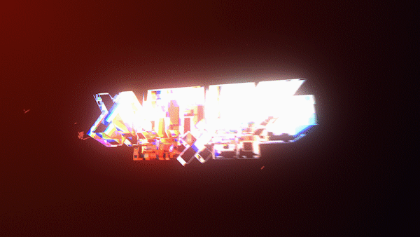
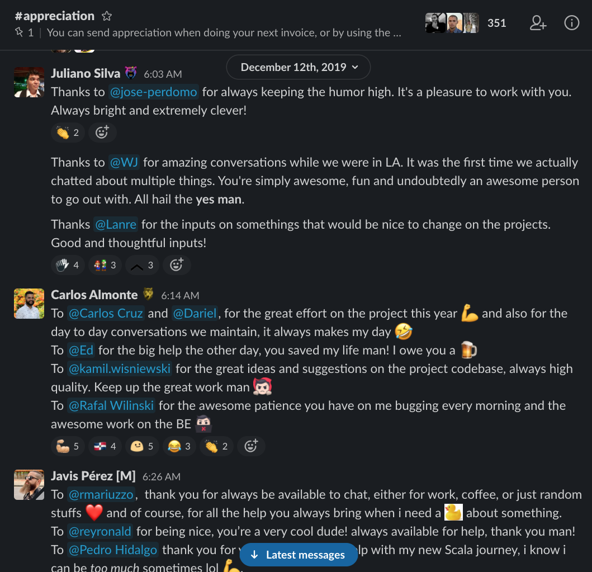

# X-Mas 2020: Here to Stay.

Join us **December 17th** for our final mega-event of the year that assembles all of X-Team. And this year, X-Mas 2020 is raising the bar once again.

**Put simply: you don't want to miss it.** 

Here's a rundown of what you can expect on December 17th.

## **X-Mas 2020 Livestream**

If you only experience one piece of X-Mas 2020, make sure it's this. Best experienced live, the X-Mas 2020 livestream will give you your last energy boost of the year and a taste of what's to come in X-Team's future.

Enjoy some epic jams, heartfelt moments, hype for the future, and of course, plenty of memes.



**Schedule:**  
10AM PDT: Pre-Show feat. _Sung_  
11AM PDT: Main Event, hosted by X-Team's CEO

### **Livestream Pre-Show feat.** _**Sung**_

This year's pre-show features [X-Team Radio](https://radio.x-team.com)'s \#1 retrowave DJ, [_**Sung**_](https://sung-music.bandcamp.com/), who will deliver an epic live set exclusively for X-Team. Most retrowave DJs don't perform live, so it's a rare experience.

Get a taste for his retrowave music below:



## The After Party

Starting at 2PM PDT after the Livestream, The After Party will host a live video hangout for anyone who wants to keep the energy going. Grab drinks + food with Unleash+, and come enjoy games and good vibes.

## Appreciation Bomb

Every year, we dedicate this day to filling our [\#appreciation](https://app.slack.com/client/T0257R0RP/C4K38NPT5) channel in Slack FULL of gratitude. This is your moment to thank each and every X-Teamer who made an impact in your work and life in 2020.

Get in on the action on December 17th [here.](https://app.slack.com/client/T0257R0RP/C4K38NPT5)

## Star Drop

It wouldn't be X-Mas without a ⭐ Star Drop. Immediately following the Livestream, watch [\#xhq in Slack](https://app.slack.com/client/T0257R0RP/C02AJK99Z) for your chance to claim a ⭐, which allows you to purchase any 1 item in The Vault.

## Vault Drop

It's a good time to get those coins, or snag a [Star](x-mas-2020-here-to-stay..md#star-drop), because when The Vault opens at 3PM PDT, you'll want to jump on it quick. Here's what to expect:

* **1 new Legendary item** \(hint: it's another desk collectible :eager:\)
* Return of some **popular items** from 2020
* Return of our [**Save the Children**](https://www.savethechildren.org/) donation drive
* The official X-Mas 2020 collectible t-shirt, "Here to Stay"

## More Surprises...

We can't tell you everything, but there will be plenty of other goodies to enjoy as we celebrate 2020 and X-Mas once again. See you there, and may the X be with you.

