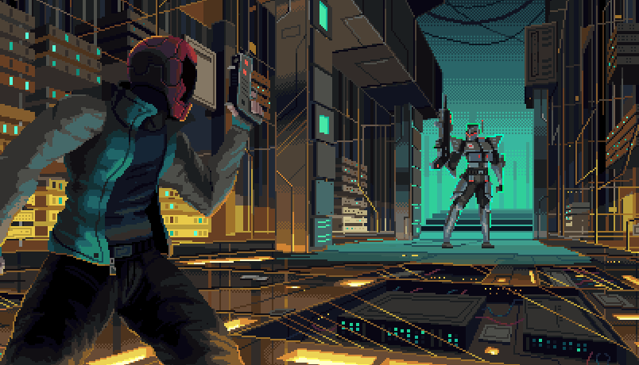

# GameCon

## Introduction

GameCon 2021 is a celebration of game changers. A month to be filled with the energy from the games that changed the industry, that changed the players, and that changed the game.



## The Tower

Climb to the top of Shadowcorp's well guarded **TOWER** and reclaim the best of all our futures.

Upgrade yourself, defeat waves of enemies and climb to the top in our new async roguelike Slack game!



## The Arena

Our already established popular battle royale Slack game is also back!

The game you already know and love now with one amazing additional feature: **BATTLE ZONES.**

Each round you will be grouped with up to five other players that you can attack or be attacked by during that round. No more random targeting and killing your Housemates, you choose where your bullets go.

This new addition will allow much more depth to the strategies each player and House can employ to secure their victory and it serves as the foundation for a bunch of other cool things being built.



## Missions and Bounties

###   Game Changer Awards

This special set of Bounties soon to be released will initiate our Game Changer Awards which winners will be revealed during GameCon's last event - the Trivia Dungeon Livestream.

#### Nominate Games

Think of the games you've played that really touched and changed you, that did something that had never been done before, the ones that modified the way that you look at the world and the way that people think about games themselves. Share them with the rest of the community by nominating them to the Game Changer Awards.

#### Play the Nominated Games

Check out the list of games that deeply impacted the gaming industry and the lives of their players built by our community and take some time to get to know some of them. Choose one to play, write your review and share with other members of the community.

#### Vote on your Favorite Games

After playing some of the nominated games, vote on your favorites to help define the final list of contestants to be presented at the Trivia Dungeon Livestream at the end of GameCon. Only the top most voted games from the list of initial nominations will be presented at the show.

#### Celebrate the Game Changer Awards

During the Trivia Dungeon Livestream, the winner will be announced and we will celebrate the winning game in a special way. Rewards will be given to the person that nominated that game and to the other X-Teamers that participated in the whole event.

## Vault Drop Tuesdays

During GameCon our Vault Drops will be extra special, so make sure to engage with the Bounties and collect coins to be prepared for the sweet collectibles that will be available.

### Community Collab

We are also going to build together X-Team's official **pantheon of gaming characters** and celebrate it by including the most voted ones in an **exclusive design**.

The Pantheon starts out with five spots but with enough energy and engagement it can be increased up to ten - to fit all of the most amazing characters voted by the community.

Votes will be decided in an Auction System using coins so that is another reason for you to commit to those bounties you have favorited but haven't collected yet.

## Trivia Dungeon Livestream

GameCon will end in a gameshow livestream event with a big variety of attractions as the culmination of the amazing things we all will build together over the course of these three weeks.

More information about it coming soon \(although we might have dropped some hints already\).

