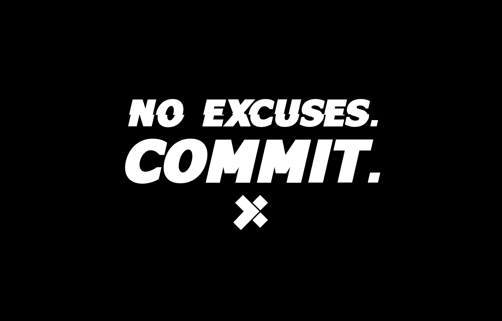
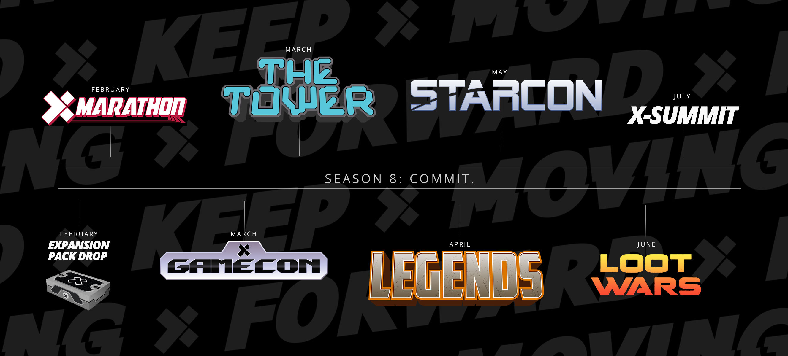
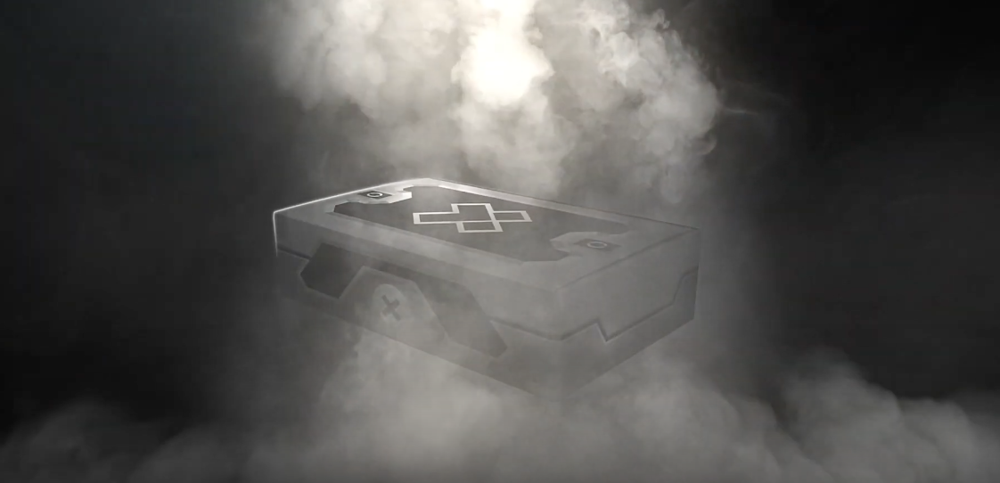
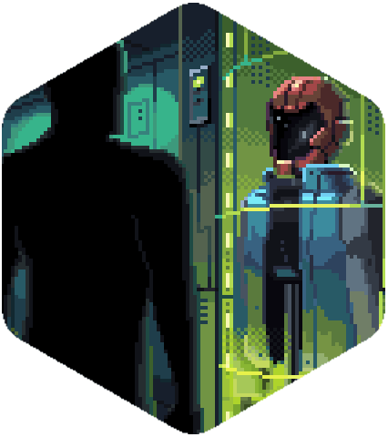
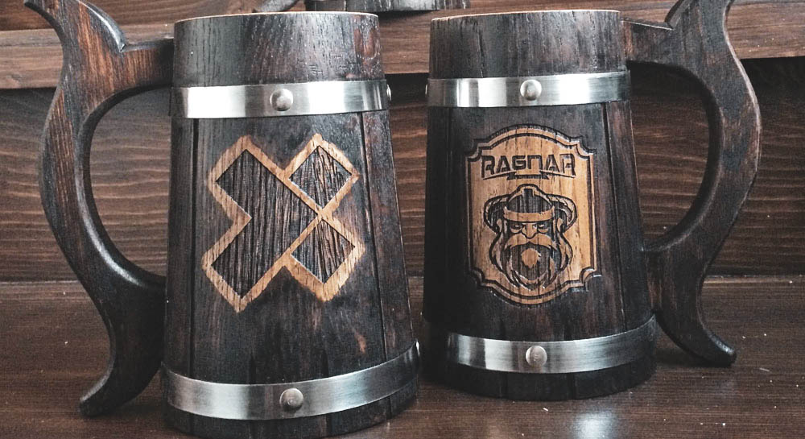

# Guide

## Reveal Trailer



## Introduction

Welcome to **Season 8:** _**COMMIT.**_

> "These guys are from the future." - Biz Stone about X-Team

2020 gave us **a taste of who we can become.**  
_****_It’s harder to make excuses now.  
So don’t.  
Sudo them. Crush them.  
Everything about **who we are can be upgraded.**  
Our flaws patched.  
Our limits pushed.  
Our excuses crushed.  
Our weaknesses refactored.  
Choose to be **stronger than your excuses.** Outperform them. **Surprise yourself.**  
_“What we can be, we must be.”_  
_**Commit.**_

### What we can be, we must be. _Commit_.


**If this is your first time participating in a Season at X-Team**, Seasons are multi-month experiences crafted to help you learn, grow and explore. Each theme has its own theme and accompanying Events, Bounties, Collectibles, and more which you'll find out more about below.


## Events

X-Team Events are one of the greatest ways to get a boost of energy during the season. Check out what is coming in the timeline above and make sure to subscribe to the[X-Team Community Calendar.](https://calendar.google.com/calendar/u/2?cid=Y29tbXVuaXR5QHgtdGVhbS5jb20)

### Expansion Pack Drop \#01

As promised at X-Mas 2020, this year will mark the beginning of putting more X-Team collectibles into the hands of _**all**_ X-Teamers more often. 

Expansion Packs are custom-built boxes that will soon land on your doorstep and contain all-new Vault items per pack: 2 Common and 2 Rare. This year will see two Expansion Packs drop, and the first is very soon.

Pre-orders begin soon, watch \#x-announcements on Slack for more.

### X-Marathon

A three week long event in which each House has to rally their members to complete themed marathons. Although the first two weeks are focused on running and cycling, the third week was planned to be viable even for the X-Teamers still under strict lockdowns. Alongside the main event we will also have some cool side activities and everyone can contribute to their House in their own way.

Complete information about the X-Marathon will be added to the guide this Friday.

## Bounties

Bounties are personal challenges that you can take part in every Season designed to get you energized by doing more of what you love. They are like the achievements or trophies in your favourite video game, but in this case, the game is your life.

You can "Favorite” or "Hide" Bounties to organize them in your own special way. Bounties also earn you coins for you to exchange for collectibles, experiences and charity donations at The Vault.


Rule: You can't claim multiple Bounties for the same action.


### Missions

Missions are sets of connected Bounties with exclusive rewards once completed. They are available for a very limited amount of time and will sometimes give hints about X-Team's future events.

The first Mission and its set of three Bounties are already available to be collected:  
  **Watchman ID:** join \#s8-commit on Slack and present yourself in three sentences.  
  **An Exquisite Fuel:** post a picture on \#s8-commit of your most unique source of motivation.  
  **The Better After:** post on \#s8-commit a list of predictions for the future of humanity in the year 2121.

### Bounty Drops

To keep the rhythm going, during this Season you can expect a new bounty every Monday and Friday to give you that helpful boost to either start the week or enjoy your weekends. Sometimes they might even be a Mission or a chapter of the Legendary Bounties, so make sure to keep an eye out for them.

The initial set has five Bounties for you to claim:

 **Patch Your Flaws:** take a couple of hours to work on something on you that needs improvement.   
 **Push Your Limits:** go the extra mile on that special unique passion you have.  
 **Crush Your Excuses:** stop procrastinating on that thing you wanted to do and finish it.  
 **Refactor Your Weaknesses:** join the \#club channel you least know about and challenge yourself.  
 **Outperform:** become the best of something somewhere somehow in your own way.

### Legendary Bounties

Check out the Bounties page for more details on how to claim these bounties.

These beautifully animated special Bounties are the flagship of the Season: collecting them will drive you through an interactive narrative intended to push you towards reaching higher and higher goals while also getting higher and higher rewards.

_**Chapter One**_ will soon be available to be explored:

### Create Your Own Bounties

You can create private bounties to gamify and keep track of your personal and professional goals as well as create public bounties for the community to engage with and collect.

* A Bounty shouldn't be too easy or pointless.
* A Bounty should motivate someone to do something that energizes them or adds value to their life or the lives of other X-Teamers.
* You can create up to 10 Bounties per Season.
* **All Creator Bounties start at a value of 1 coin**, but once 3 people have claimed it, those 3 people will receive 2 coins & 1 Luna, _and_ the Bounty's value will increase to 2 coins for everyone as well.

If you want to edit or remove your Bounty, please contact \#support-desk


Custom Public Bounties that don't fit these guidelines will be removed.



**How Bounties Work:** Every time you complete a Bounty, you will gain coins. These can be used in[ The Vault](https://xhq.x-team.com/vault) to purchase different kinds of Loot, from hats and notebooks to t-shirts and donations to charity, you should always have something to put your coins towards. New items are added to the Vault regularly \(see Vault Drop Tuesdays\), so be sure to check back often so you don't miss out on something awesome.


## Houses

Houses are the 'guilds' or 'micro-communities' within the greater X-Team Community. They're a great way to meet other X-Teamers and gain exclusive privileges and rewards.

### House Roster





House Leader: @Juliano






House Leader: @kdemoya






House Leader: @ryanchartrand






House Leader: @Barklund






House Leader: @Cristian Morales






House Leader: @Jomar



{% tab title="5\#4\)0^\(0%?" %}


&gt; @10+ \(0//!7 V4 V/ "!\`7&%\(&?7!~6 ^47\(\#/4~ ?%0$&\(7"




### Flagbearers

Before the Season launch we prompted the Leaders of each House to select another member of their team to take on a new role: Flagbearer. Its main purpose is to help engage their House in the activities we promote while also being there for every member of the guild to continuously listen to feedback and help us do what we are here to do: make sure that every X-Teamer feels represented in at least some of the events we promote, games we create and moments we share.

### Luna and Perks

[Perks](../season-7-fight-to-the-end./house-perks.md) are exclusive privileges that the Houses of X-Team can earn.  
[Luna](../season-7-fight-to-the-end./house-perks.md) is earned by House members participating in Events.  
  
One of the House Leaders’ main tasks is to listen to their teammates' requests and manage Luna wisely, spending it on Perks that matter most to their members and strengthen their bonds.  
  
Here are some examples of Vault Perks redeemed last season:

### Launch Days

Every two months we will have an intimate special event to welcome the new additions to X-Team. During which each House will have two minutes to present a pitch in order to express to the newcomers why they should join their Houses and represent them in upcoming events.

### Fireside: Houses

Over the course of this Season we will help each House to manage one special group call to grow their team spirit and personality in their own way. You can even use the Team Happy Hour category on Unleash+ to make it even more special. The Firesides will culminate in an All-Houses Fireside at the X-Summit 2021 in July.


You can join a House by going to your [Profile ](https://xhq.x-team.com/profile)on XHQ and selecting it on the dropdown menu under the Community section. Don't forget to save the changes to confirm it. Make sure to join the \#houses-recruitment channel on Slack and/or ping your House Leader to be properly introducted to your Houses' communication channels and events.


## The Vault

You can earn coins or stars by participating in Events or completing Bounties. These let you purchase collectibles, book experiences and donate to causes in[ The Vault.](http://xhq.x-team.com/vault)

### Vault Drop Tuesdays

Just as in the last Season you can expect new additions to The Vault every Tuesday. Here's a teaser for one of our upcoming drops:

### Vault Experiences

You can already spend coins on amazing collectibles and on helping important causes, coming in Season 8 you will soon be also able to book a slot in awesome experiences ranging from escape rooms to courses to gaming and movie nights and many many more. More information will come in a near future.

## Unleash+

[Unleash+](http://xhq.x-team.com/unleash) is your $2,500 per year budget to spend toward activities and gear that energize you. Use it this season to help you initiate new plans, to add new skills to your toolbelt and passions to your life, to commit to your goals and to push yourself to new limits.

**Beauty & Care** \(Hair, Spa, Makeup, Skin Products, etc.\)

**Connection Gear** \(Docking Station, Hub, etc.\)

**Creator Support** \(Patreon, Commissions, Twitch, etc.\)

## Featured Causes

As new causes are introduced during the Season Events they will be added to The Vault for further support and mentioned on this section so you can revisit them whenever you like.

And, of course, you can always support any cause that's important to you by purchasing the "$50 to Any Cause" item from[ The Vault](https://xhq.x-team.com/vault) using your coins earned from[ Bounties](https://xhq.x-team.com/bounties) and Events.

