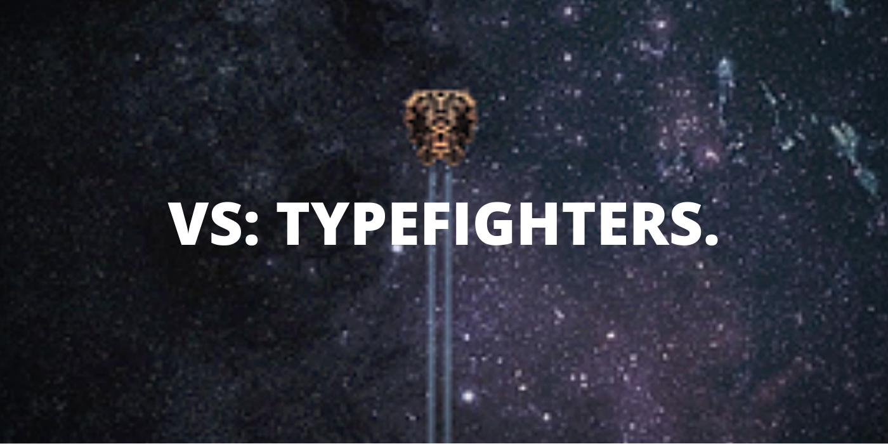
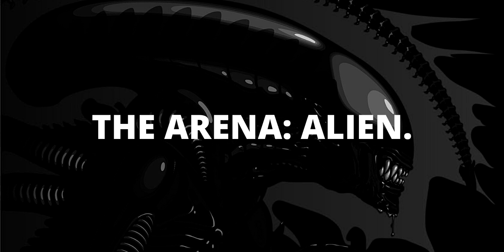
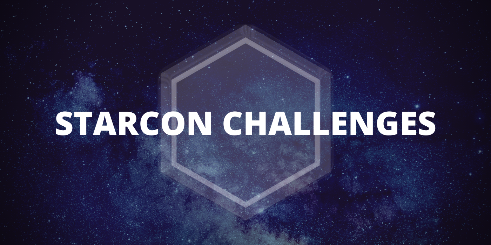
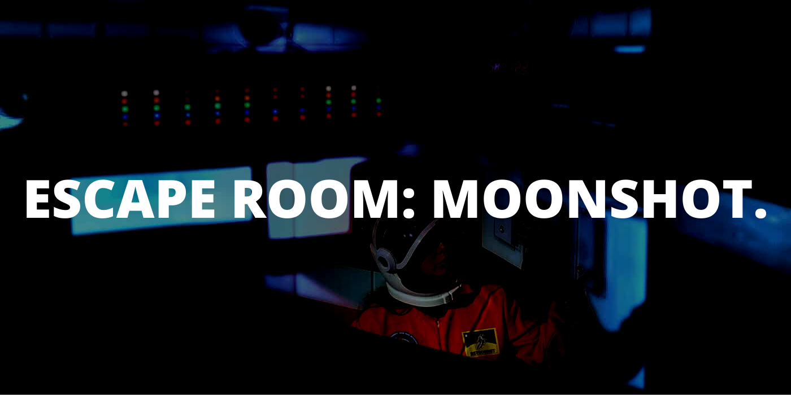
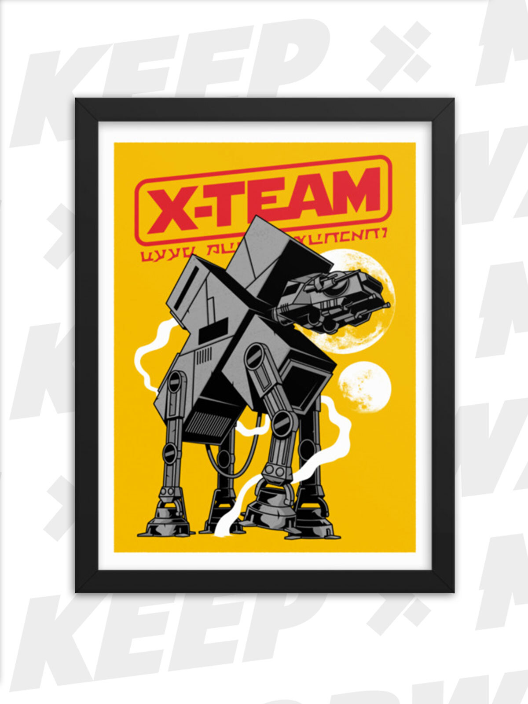
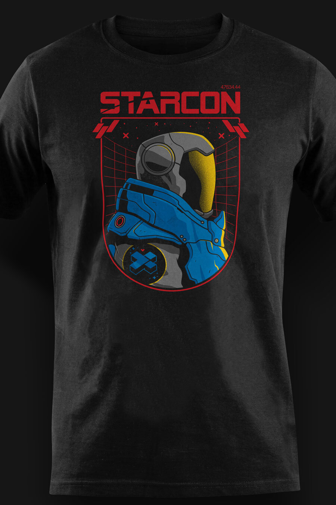
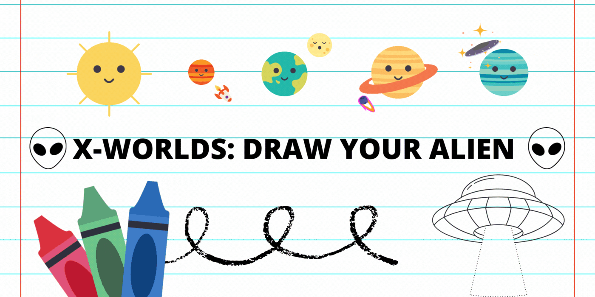
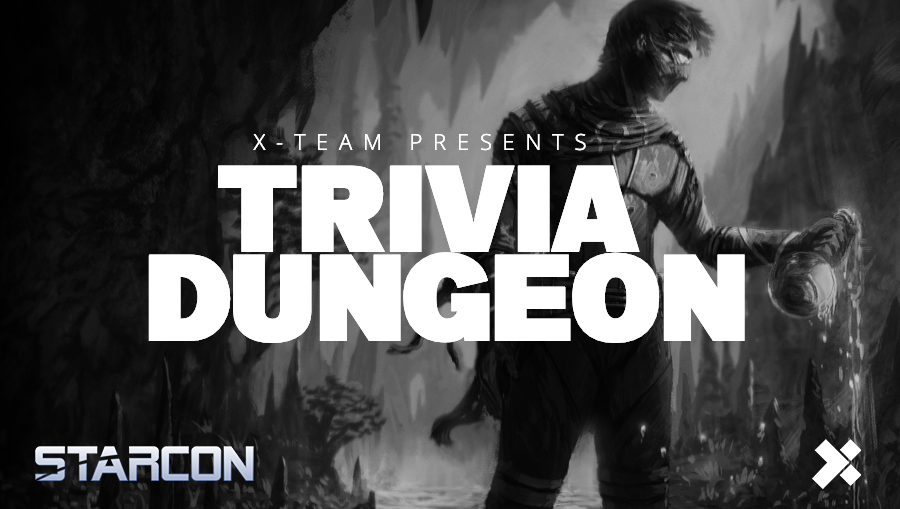

# StarCon

## Introduction

StarCon 2021 is a celebration of discovery. A month to be energized by your sense of wonder, by the invitations of the most mysterious unknowns and by our hunger for knowledge and adventure.



##  VS: Typefighters

From Wednesday - June 16 - to Monday - June 21 - the best pilots and fast typers in X-Team will face-off in a test of skill, accuracy and speed. Join the squadron of VS: Typefighters by [playing the game](https://zty.pe/) and submitting screenshots to the [\#vs channel](https://app.slack.com/client/T0257R0RP/CGK10CSLU) on Slack.


Make sure to follow the format of this example: " 3469"


### Bounties

As soon as the competition begins all players are eligible to collect the bounties below:

*  **EAGLE 5**: finish a run with **1000 points** or more.
*  **THE MILANO**: defeat **20 waves of enemies** or more.
*  **USS ENTERPRISE**: finish a run with **4000 points** or more
*  **DISCOVERY ONE**: complete a run with a **500 letters streak** or more

Collecting all **four bounties** available will also generate **2 Luna** for your House.

### Leaderboard

The Top 8 players in the leaderboard will also receive additional rewards.

1. **Millennium Falcon**: the 1st place will receive 5 coins and 5 Luna.
2. **X-Wing**: the 2nd and 3th places will receive 3 coins and 3 Luna.
3. **TIE Fighter**: from the 4th to the 8th place - will receive 2 coins and 2 Luna.

These players will also be qualified for a future event in which will be decided who will receive the exclusive title of **TYPING LEGEND** and all the additional rewards that come with it.

## The Arena: Alien

The dark and claustrophobic battlefield of the USCSS Nostromo awaits you for this special edition of our favorite Slack-based battle royale game - The Arena.

Scarce options and not a lot of places to run to and hide. A powerful Xenomorph is on the loose hunting its prey - you. Hold your breath, walk in the shadows and don't make any noise, the alien might be right behind you at all times and in space no one can hear you scream.

Become the sole survivor in order to activate and use the only escape pod not damaged when the Watchman's Spaceship crashed into the Nostromo.

The winner will also receive an exclusive vault item.



## Bounty Drops

Bounties are personal challenges that you can take part in every Season designed to get you energized by doing more of what you love. They are like the achievements or trophies in your favourite video game, but in this case, the game is your life.

* **STARCON SciFi Challenge**: add a game, movie, anime or other visual media to our X-Collection.
* **STARCON Podcast Challenge**: we will create a Spotify Playlist with podcasts and soundtracks.
* **STARCON Book Challenge:** let's build our very own X-Library starting with the Sci-Fi section.

## The Vault

You can earn coins or stars by participating in Events or completing Bounties. These let you purchase collectibles, join exclusive experiences or donate to causes in [The Vault.](http://xhq.x-team.com/vault)

### Vault Experiences

Join forces with your X-Team colleagues to try and beat this amazing remote team escape room experience. Virtual bot assistents, remote controllable props, live human host and puzzles in both worlds: real and digital. All that and more awaits for you in this brand new adventure.



### Vault Drop Tuesdays

During StarCon our Vault Drops will be from out of this world! So make sure to engage with the Events, create and claim fun and exciting themed Bounties and collect coins to be prepared for the sweet collectibles that will be available during the next three weeks.

Starting with this amazing wall print of your very own massive ATXT striding on new worlds and advancing our forces from the digital world to the decoration of your office.

And continuing on with other amazing drops over the course of these three weeks we will have a second chance to acquire one returning favorite and amazing new designs like the official STARCON shirt above.

### X-Worlds: Draw Your Alien

Created to foster and appreciate the creativity and greatness of the currently smallest future X-Teamers in the world, this activity was designed as a way to generate a fun and energizing quality time between X-Teamers and the children they support either through family bonds, community service or other means.

The adult will be asked to explain basic concepts like the planets in our solar system or how many moons Jupiter has - anything that can easily be captured by the child to spark their curiosity - and then prompt them to come up with and draw their own interpretation of how alien species would look like.

The submissions will be voted with reactions by the community - always with care, love and appreciation - and we will ask for the official X-Team artists to transform some of the children's vision into amazing artworks to be added to an exclusive design to be released on the Vault after StarCon.

Make sure to avoid telling the children about the prize!  
Let's make it a surprise for them. 

## Unleash+

Unleash+ is your $2,500 per year budget to spend toward activities and gear that energize you. Use it this event to spark your curiosity and to acquire new knowledge to keep you moving forward.

The featured categories for StarCon are:

* **Courses and Books**: never stop learning by getting an online course or book in any topic.
* **Scholarship**: sponsor someone's learning and growth.
* **Unleash Your Family**: courses, tools and apps to empower your children's maker spirit.

But feel free to explore all the other options in this universe of energy and excitement. 

## Trivia Dungeon Livestream

StarCon will end in a livestream event with the special participation of an amazing scientist for a Q&A, a fun trivia game to support a special cause and much much more.

We will be offering support to the[ Astronomical Camp 2021 in Poland](https://oboz.almukantarat.pl/) in order to allow it to receive more people and hopefully inspire a new generation of explorers.

