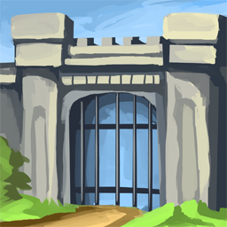
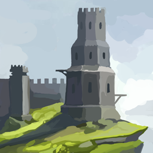
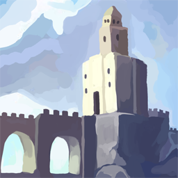
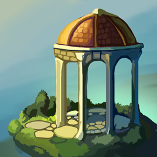
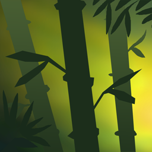
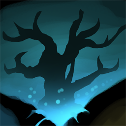
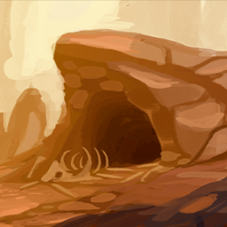
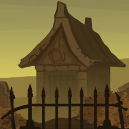
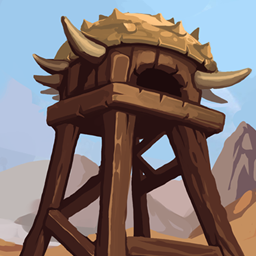
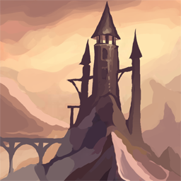

# The Arena

##  Lore



The Arena is X-Team's virtual battle simulator created to train us for the future battle against Shadowcorp. The arsenal from their Tower is available in the Arena so we can get used to them and the Last Hunter Standing is promoted to the Champions Circle - a group of respected Watchmen from which battle patterns are extracted and recorded in protocols to be later downloaded as perks.

##  How it Works

You start the game with **100HP**, no weapons and nothing in your inventory but the will to fight.

From here, the game is broken into a series of rounds. Each round, you can execute **one** action.

### Actions

* **STATUS**: check additional details about your inventory and conditions \(**does not count as an action**\).
* **CHEER**: support one of the players currently alive \(can be used even if you were eliminated\).
* **SEARCH**: for **WEAPONS**, **ARMOR** and **HEALTHKITS**. \(makes you visible\).
* **HUNT**: attack another **player in your BATTLE ZONE** with one of your available **WEAPONS**.
* **HIDE**: makes you **not visible** for players using **HUNT** during that round.
* **HEAL**: heal yourself or another player for **35HP** \(requires **HEALTHKIT** and can revive fallen players\). 


To select an action to execute, type **/arena** in slack to bring up your options.


##  Locations

When a round begins your character moves to one of the Locations below and your actions can only affect and be affected by players within the same Location. When the round ends your character moves to another Location with a new set of players to interact with. As the game progresses, some locations get deleted increasing the chances of players to meet one another more frequently.

*  Closed Gate
*  Obsidian Tower
*  White Fortress
*  Shrine Time
*  Phoenix Pyramids
*  Bamboo Forest
*  Ursine Darkwoods
*  Pridelands
*  Canine Mansion
*  Viking Watchtower
*  Lupine Woods
*  Irondrake Castle

###  Ring of Fire

After a certain amount of rounds a Ring of Fire might appear, destroying hiding places in every Location and transforming the Arena into an open field. When active, players won't be able to select the Hide action and will be automatically visible for all players in the same Location.

##  Weapon List

##  Awards

At the end of The Arena players will be rewarded for their Outstanding Performance. The winner of each Award will receive 1 coin and generate 1 Luna for their House:

*   **First Blood:** the first player to kill an opponent.
*   **Damage Dealer**: the player that dealt the most damage
*   **Medic**: the player that healed the most damage
*   **Bullet Dodger**: the player that evaded most attacks
*   **Grim Reaper**: the player that dealt the most killing blows
*   **Arms Dealer**: the player that collected the most weapons
*   **At least we got health**: the player that found the most Health Kits
*   **Airdrop Catcher**: the player that reached the most Airdrops
*   **Cheerleader**: the player that cheered the most
*   **Public Favourite**: the player that received the most cheers

###  Last Hunter Standing

Besides receiving coins and generating Luna towards his House, the last watchman standing will be rewarded with our exclusive Backpack.

##  Champions Circle

1. Lucas Bassetti \(2 victories\)
2. Marcin Pietruszka \(1 victory\)
3. Jedrzej Kurylo \(1 victory\)
4. Jan Makara \(1 victory\)
5. Lucas Moreira \(1 victory\)
6. Jomar Garcia \(1 victory\)
7. Edmilson Robson Rocha Lima \(1 victory\)

##  How To Join

If this sounds like fun to you, visit the Vault to purchase an "Arena Pass" for 2 coins to secure your spot in the Arena. Arena Passes are posted 1-2 days before an event. [https://xhq.x-team.com/vault](https://xhq.x-team.com/vault) 

