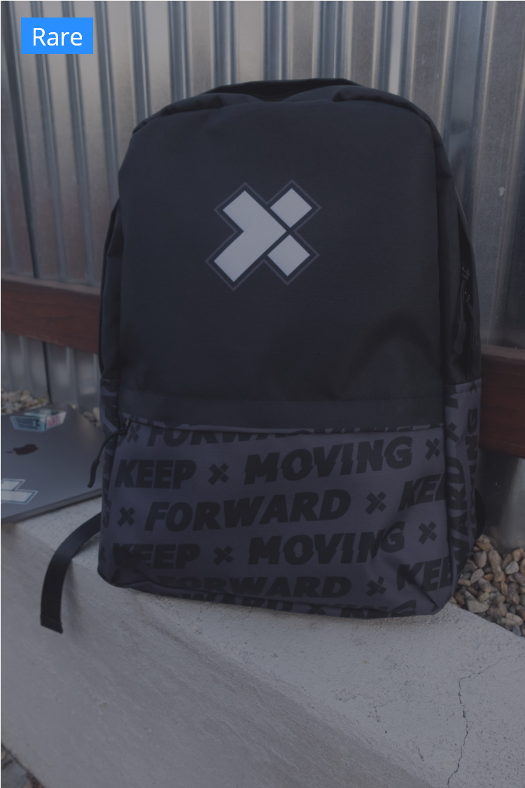

# The Arena

## Lore

The Arena is X-Team's virtual battle simulator created to train us for the future battle against Shadowcorp. The arsenal from their Tower is available in the Arena so we can get used to them and the Last Hunter Standing is promoted to the Champions Circle - a group of respected Watchmen from which battle patterns are extracted and recorded in protocols to be later downloaded as perks.

## How it Works

You start the game with **100HP**, no weapons and nothing in your inventory but the will to fight.

From here, the game is broken into a series of rounds. Each round, you can execute **one** action. To see a list of actions you can take, type **/arena** in slack to bring up your options.

### Actions

* **STATUS**: display your health, inventory and visibility status \(**does not count as an action**\).
* **CHEER**: support one of the players currently alive \(can be used even if you were eliminated\).
* **SEARCH**: for **WEAPONS**, **ARMOR** and **HEALTHKITS**. \(makes you visible\).
* **HUNT**: attack another **player in your BATTLE ZONE** with one of your available **WEAPONS**.
* **HIDE**: makes you **not visible** for players using **HUNT** during that round.
* **HEAL**: heal yourself or another player for 35HP \(requires **HEALTHKIT** and can revive fallen players\). 

### Conditions

* **BATTLE ZONE**: group of players that you can attack or be attacked by during that round.
* **RING OF FIRE**: makes **HIDE unavailable** and forces hidden players into the visible field.
* **AIRDROP**: use **RUN TO AIRDROP** for a shot at getting a legendary prize \(**requires WEAPON**\).

## Weapon List

## Awards

At the end of each Arena battle, awards will be automatically generated to show Outstanding Performance. The winner of each Award will gain 1 coin as a consolation prize. The Awards are: 

* DAMAGE DEALER: the player that dealt the most damage
* MEDIC: the player that healed the most damage
* BULLET DODGER: the player that evaded most attacks
* GRIM REAPER: the player that dealt the most killing blows
* ARMS DEALER: the player that collected the most weapons
* AT LEAST WE GOT HEALTH: the player that found the most Health Kits
* AIRDROP CATCHER: the player that reached the most Airdrops
* CHEERLEADER: the player that cheered the most
* PUBLIC FAVORITE: the player that received the most cheers

### Last Hunter Standing

Besides receiving coins and generating Luna towards his House, the last watchman standing will be rewarded with our exclusive Backpack.

### Champions Circle

1. Lucas Bassetti \(2 victories\)
2. Marcin Pietruszka \(1 victory\)
3. Jedrzej Kurylo \(1 victory\)
4. Jan Makara \(1 victory\)
5. Lucas Moreira \(1 victory\)
6. Jomar Garcia \(1 victory\)
7. Edmilson Robson Rocha Lima \(1 victory\)

## How to Join

If this sounds like fun to you, visit the Vault to purchase an "Arena Pass" for 2 coins to secure your spot in the Arena. Arena Passes are posted 1-2 days before an event. [https://xhq.x-team.com/vault](https://xhq.x-team.com/vault) 

