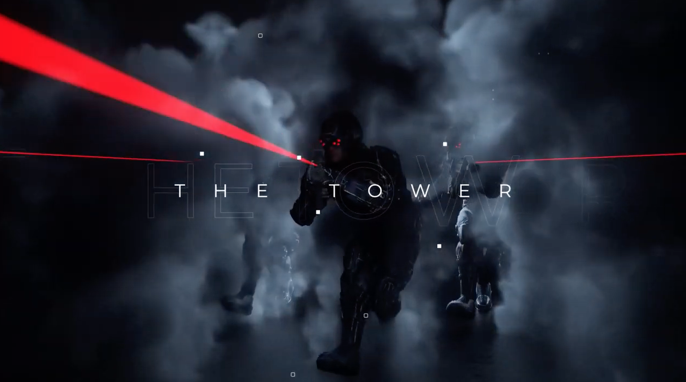
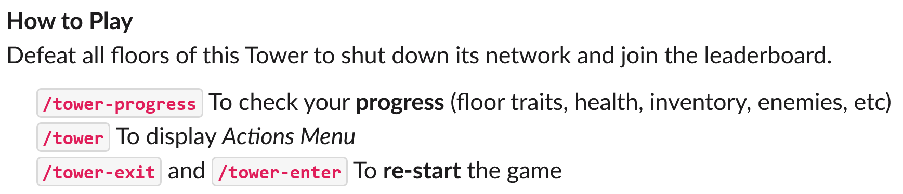
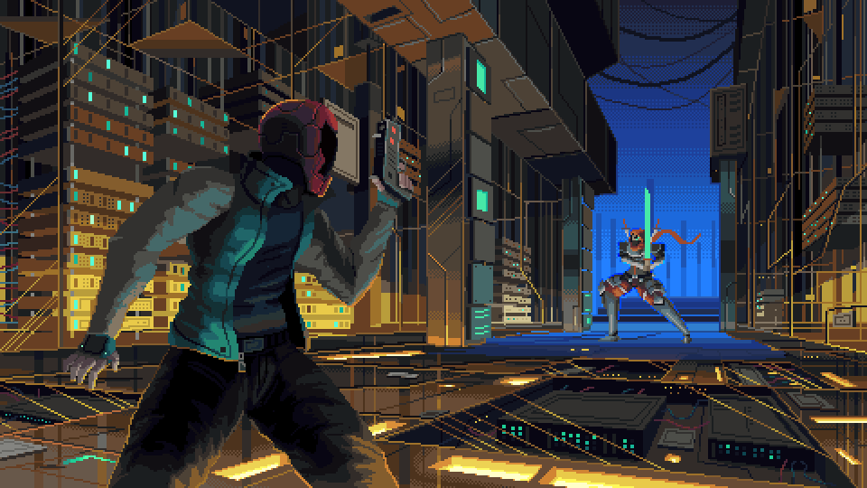
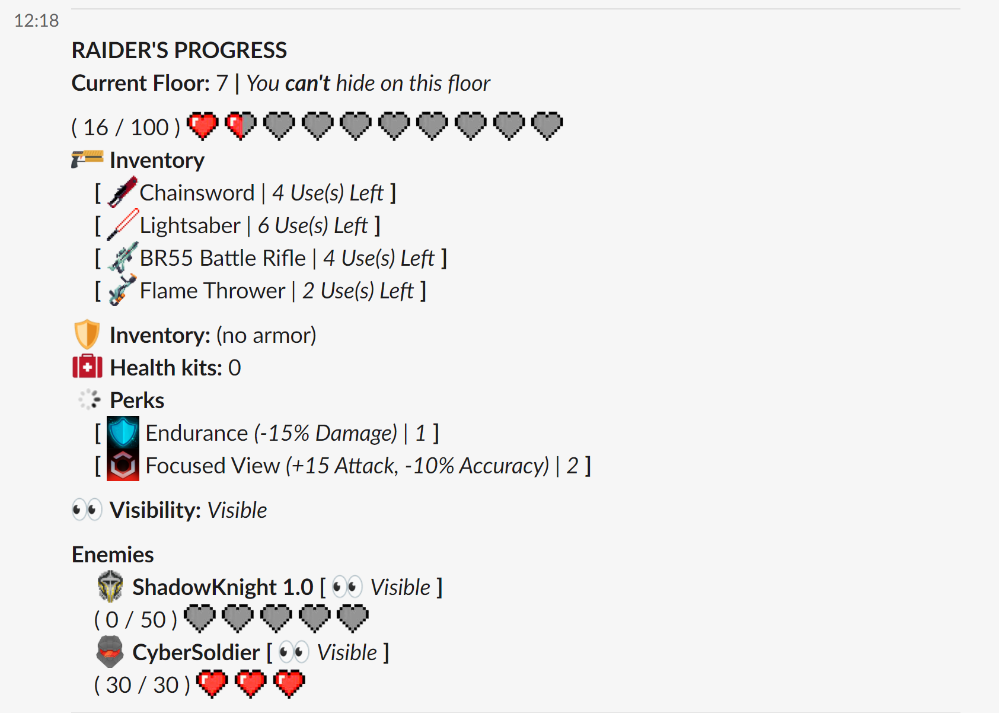

# The Tower

## Lore

In order to send and intercept messages from the future, Shadowcorp distributed their stolen copy of the Watchman technology across a network of nodes around the world. They are located on the TOP FLOOR of hundreds of impenetrable **TOWERS** able to replicate machines and cyber-soldiers as a defense mechanism to stop intruders from advancing.

We must destroy this network and prevent Shadowcorp from sabotaging our future for their own gain.

## How it Works

First, join [\#the-tower](https://app.slack.com/client/T0257R0RP/C01L4M80FE1) on Slack to be part of The Tower community.

You enter the tower with **120HP** and a   **Watchman's Chronogun** in your inventory.

The Tower has **12 floors** with enemies to defeat.

Reach the final floor and **defeat the final boss to win the game**.

If your HP is reduced to 0 you get defeated and must start the tower over.


Defeating the Tower rewards you with Coins and generate Luna to your House.


### Battle

During battles you can select one of the following actions:

* **SEARCH**: for either WEAPONS, ARMOR or HEALTH KITS.
* **HUNT**: attacking an enemy with one of the WEAPONS in your inventory.
* **HIDE**: protect yourself from incoming attacks if the floor you are in has places to hide.
* **HEAL**: using a HEALTH KIT or other items you might have.

Weapons, Armors and Perks are divided in different categories of rarity \(Common, Rare, Epic, Legendary\) and it determines how strong they are and how likely they are to be found in searches or dropped in loots.

### Advancing Floors

You advance to the next floor by reducing your opponents' HP to zero. Doing that also grants you special rewards in the form of **LOOT** \(1 or 2 items added to your inventory\), **PERKS** \(power ups that increase your performance in battle in a variety of ways\) and **SEARCH UPGRADES** \(in the beginning of the game you can only find common equipment but as you advance better equipment can be found\).


If the **PERKS** available are not suitable for your current situation or if you would like to avoid them for any reasons you might have, you can also select an extra item as **LOOT** instead.


### Tracking Progress

At any moment you can also run the /tower-progress command or select it from the actions menu to check your current progress. It does not count as an action in the battle.

Here you can see the current floor you are on and if you can hide in it, you current set of weapons, armors, health kits and perks as well as your and your enemies' HP and current visibility status.

Good luck on your climb Watchman, the future is counting on you.

## Legendary Challenges

We have already selected our first four champions to fight for the title of Tower Legends:

  Lucas Basetti  
 Maya Zafran  
 Mario Propper  
 Lauren Ferreira

Now all players have a second chance of joining that list by being the best at completing one of the four challenged below:

###  Pacifist

The **Pacifist Challenge** is focused on defeating the Official Legends Tower Setup **without using any Perks to increase your attack power**. Which means that the only perks available during a pacifist run are:

 Hyper  
 Unstoppable  
 Endurance  
 Herbology

The player that successfully complete the Pacifist Challenge more times than their competitors will be able to join the first four champions in the Tower Legends Finals.

###  Minimalist

The **Minimalist Challenge** is focused on achieving absolute control over your inventory and defeat the Official Legends Tower Setup while **finishing the game with the smallest inventory possible**.

The goal is to complete the game having in your final backpack only the **Watchman's Chronogun**, no ****Medkits left \(or the least amount possible\), no      **Armor** of any type.

The player that successfully complete the Minimalist Challenge more times than their competitors will be able to join the first four champions in the Tower Legends Finals.

###  Champion

The **Champion Challenge** is focused on **defeating the Tower with the least amount of  perks possible** and - in the case of perks acquired - **of the lowest rarity possible** as well.

The player that successfully complete the Pacifist Challenge in the most optimal way possible will be able to join the first four champions in the Tower Legends Finals.

###  Chronomancer

The **Chronomancer Challenge** is focused on pushing the limits of the new Initiative System and **finish the tower with either the highest or the lowest amount of initiative you possibly can**.

You start the game with 100 initiative points. This number is reduced by 1 every time an enemy lands a critical hit on you and is increased by 2 every time you land a critical hit on a enemy. You can also learn   Hyper in order to get 4 extra points per critical hit dealt.

Although it might seem completely random, the weapons you select to attack, the order you defeat your enemies and the amount of turns you take to do so, can fully tilt the initiative system either against you or in your favor.

The player that successfully complete the Pacifist Challenge in the most optimal way possible \(largest difference between the player's final initiative value and 100\) will be able to join the first four champions in the Tower Legends Finals.


If no one completes a challenge or if one of the four first finalists manage to complete it the most, no new player will advance to the final list.


If you manage to climb all ten floors and beat the tower, share a screenshot of your Raider's Progress on the Legendary Challenges thread pinned on **\#the-tower** to claim the top spot at a challenge.

Feel free to help your teammates by sharing strategies and information on your House channels.

