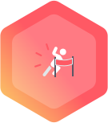

# X-Marathon

## Introduction

We fought to the end of Season 7 and now it's time to spread the news of our victory. No distance will stop us from bringing home our commitment to keep moving forward.



## 1st Week: RUN.

### How to Participate

From February 25 through March 4, any X-Teamer can participate by **submitting a valid run** using any app or device, as long as it clearly displays **travelled distance \(km\).**

To be considered a **valid submition**, your post must have **at least 2 Km of travelled distance**. Feel free to follow your own pace and rhythm, you can also walk if you prefer.

Proof of your run should then be submitted by posting a screenshot/photo to the **\#s8-commit** Slack channel using this format: **:vs: \[distance in km\]**


If you are a member of one of the Houses, make sure your "Team" is properly set in your [XHQ profile](https://xhq.x-team.com/profile) so it can be added to your House's Total.


Another way to participate - especially if posting a run is not a viable option for you - is to engage with the **mini events** we are going to have throughout the week and to **collect and create new Bounties**.

### Bounties

Even if you aren't a member of a House you can still engage with the Bounties related to the event. The first ones, to be added tomorrow, are:

 **Prepare Yourself**: buy something from one of the following Unleash+ Categories \(Bike Rentals, Running Shoes and Gym Membership\) and post it on \#s8-commit.  
 **Start Moving:** submit a valid run \(over 2km of travelled distance\) to \#s8-commit.

We are also going to release a **batch of club-related Bounties** for you to collect over the course of the X-Marathon. Make sure you keep an eye open for the **Bounty Drop Mondays and Fridays** to increase your coin ammount and get all those special items from the Vault when they drop.

### Mini Events

Over the course of the week some special mini events might happen at any moment on the **\#s8-commit** and the **\#vs** Slack channels. These events might require you to post something or to do a quick task. Completing them will unlock new information about the next two weeks of X-Marathon as well as prevent attacks from an unknown digital menace that has been creeping into some of our channels.

### House Objectives


**Goal:** Reach a **total House sum of** **42.2 Km** of travelled distance by next Thursday \(March 4th\).


Every House that reaches that goal will be rewarded with **20 Luna**.

_Additional Rewards:_

* \*\*\*\* **Initiative**: 5 Luna to the first House to reach the 42.2 Km mark.
* \*\*\*\* **Dominance**: 5 Luna to the House with the highest total travelled distance by the end of the event.
* \*\*\*\* **Inspiration**: 5 Luna to the House with the highest sum between their Top 5 contributors.
* \*\*\*\* **Dedication**: 5 Luna to the House with most participants in the event.


**Each House member can only have one single run added to the House Total.** The first run they submit will be added to the total automatically. Every submission after that will **replace the previous.** Adding together multiple runs in the same submission is not valid.


### Individual Objectives

If you are a hardcore runner - or is working towards becoming one - you might be interested in push your limits to strive for the special individual prizes:

* \*\*\*\* **Legend**: 4 coins to the participant with the highest travelled distance in a single run.
* \*\*\*\* **Champions**: 2 coins to the partipants between the 2nd and 5th place in that same criteria.

### Global Objective

To celebrate our comraderie and sportsmanship, a special collaborative goal can also be achieved:


If we all manage to reach a **total sum of 300 Km** or more while having **over 60 participants** contributing with valid runs, **every participant gets a coin** and **every House gets 10 Luna**.



 [Add Deadline to Calendar](https://calendar.google.com/event?action=TEMPLATE&tmeid=NWJyMGY0ZGYxaGIzNGJkZWpmODBlOWt1Mm8gY29tbXVuaXR5QHgtdGVhbS5jb20&tmsrc=community%40x-team.com) to make sure you've posted proof of your run in \#vs on Slack.


## 2nd Week: RIDE.

---

## 3rd Week: RACE.

---

