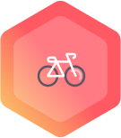

# X-Marathon

## Introduction

We fought to the end of Season 7 and now it's time to spread the news of our victory. No distance will stop us from bringing home our commitment to keep moving forward.



## 1st Week: RUN.

### How to Participate

From February 25 through March 4, any X-Teamer can participate by **submitting a valid run** using any app or device, as long as it clearly displays **travelled distance \(km\).**

To be considered a **valid submission**, your post must have **at least 2 Km of travelled distance**. Feel free to follow your own pace and rhythm, you can also walk if you prefer.

Proof of your run should then be submitted by posting a screenshot/photo to the **\#s8-commit** Slack channel using this format: **:vs: \[distance in km\]**


If you are a member of one of the Houses, make sure your "Team" is properly set in your [XHQ profile](https://xhq.x-team.com/profile) so it can be added to your House's Total.


Another way to participate - especially if posting a run is not a viable option for you - is to engage with the **mini events** we are going to have throughout the X-Marathon and to **collect and create new Bounties**.

### Bounties

Even if you aren't a member of a House you can still engage with the Bounties related to the event. The first ones, to be added tomorrow, are:

 **Prepare Yourself**: buy something from one of the following Unleash+ Categories \(Bike Rentals, Running Shoes and Gym Membership\) and post it on \#s8-commit.  
 **Start Moving:** submit a valid run \(over 2km of travelled distance\) to \#s8-commit.

We are also going to release a **batch of club-related Bounties** for you to collect over the course of the X-Marathon. Make sure you keep an eye open for the **Bounty Drop Mondays and Fridays** to increase your coin ammount and get all those special items from the Vault when they drop.

### House Objectives


**Goal:** Reach a **total House sum of** **42.2 Km** of travelled distance by next Thursday \(March 4th\).


Every House that reaches that goal will be rewarded with **20 Luna**.

_Additional Rewards:_

* \*\*\*\* **Initiative**: 5 Luna to the first House to reach the 42.2 Km mark.
* \*\*\*\* **Dominance**: 5 Luna to the House with the highest total travelled distance by the end of the event.
* \*\*\*\* **Inspiration**: 5 Luna to the House with the highest sum between their Top 5 contributors.
* \*\*\*\* **Dedication**: 5 Luna to the House with most participants in the event.


**Each House member can only have one single run added to the House Total.** The first run they submit will be added to the total automatically. Every submission after that will **replace the previous.** Adding together multiple runs in the same submission is not valid.


### Individual Objectives

If you are a hardcore runner - or is working towards becoming one - you might be interested in push your limits to strive for the special individual prizes:

* \*\*\*\* **Legend**: 4 coins to the participant with the highest travelled distance in a single run.
* \*\*\*\* **Champions**: 2 coins to the partipants between the 2nd and 5th place in that same criteria.

### Global Objective

To celebrate our comraderie and sportsmanship, a special collaborative goal can also be achieved:


If we all manage to reach a **total sum of 300 Km** or more while having **over 60 participants** contributing with valid runs, **every participant gets a coin** and **every House gets 10 Luna**.



 [Add Deadline to Calendar](https://calendar.google.com/event?action=TEMPLATE&tmeid=NWJyMGY0ZGYxaGIzNGJkZWpmODBlOWt1Mm8gY29tbXVuaXR5QHgtdGVhbS5jb20&tmsrc=community%40x-team.com) to make sure you've posted proof of your run in \#vs on Slack.


## 2nd Week: RIDE.

### How to Participate

From March 4 through March 11, the X-Marathon will evolve into its second phase: RIDE.

During this week, **you are allowed to use any fully human-powered manual individual vehicle.**

That means: bicycles, rollerblades, skateboards, \(non-motorized\) scooters, skis, snowboards, etc. Stationary bicycles and other similar equipment will also be accepted.

This time a valid run must exceed **3Km** and the proof of your run in **\#s8-commit** must include:

1. this format: **:vs: \[distance in km\]**
2. a **screenshot/photo** of any app or device clearly displaying **travelled distance \(km\).**
3. a **picture/selfie** containing **you and the vehicle** you used for your run. Make it cool. ;\)

### House Objectives


**Goal:** Reach a **total House sum of** **60 Km** of travelled distance by next Thursday \(March 11th\).


Every House that reaches that goal will be rewarded with **12 Luna**.

_Additional Rewards:_

* \*\*\*\* **Versatility**: 4 Luna to every House that uses at least four different types of vehicles.
* \*\*\*\* **Engagement**: 4 Luna to every House with more than 40% of members participating.
*  **Leadership**: 4 Luna to every House with at least one run with over 20Km.

### Global Objective

Over the course of our most recent events, we've been receiving some weird encrypted messages and having some strange interference in our systems.

The last message we got came from a different source than the other ones before it and we need your help to decypher it.


5\#4\)0^\(0%? !5 =+!\(8_1 3+!_\)!~6 4 ~&7^0%8 70 61!~ -457 \(0~7%0\* 09 0+% 9+7+%&.  
@V7&4/ /+57 570? 7\#&/. !7 !5 0+% 0~\*1 \#0?&.



The first person to successfully decypher the message will receive **12 coins** and their House will receive **12 Luna.**


Whenever someone submits a valid run that is...

* ...above **5Km**: a random character from the message will be decrypted and sent to them.
* ...above **10Km**:: a random set of four letters will be sent and they'll select one to be decrypted.
* ...above **15Km**: they'll select any letter/character of their choosing to be decrypted.

The decryptions will be handed out to the person that submitted the run via **direct message** every exact 24h after the beginning of the event \(8pm UTC\), including during the weekend.

The person can then decide if they are going to share the information with their House and/or with the rest of the participants. **Exchange of information \(including false information\) is allowed.**


At any moment someone can attempt to decode the message.  
All it needs to be done is to **tag @Leonardo Jardim** to a post at **\#s8-commit** with their answer.  
They will be checked every day 1 hour before handing out new decryptions.  
**Only the first FULLY correct decryption will be rewarded.**



If you don't tag Leonardo, you won't win.


### Individual Objectives

Just as in the first week you can push your limits to strive for the special individual prizes:

* \*\*\*\* **Legend**: 4 coins to the participant with the highest travelled distance in a single run.
* \*\*\*\* **Champions**: 2 coins to the participants between the 2nd and 4th place in that same criteria.

### Bounties

This Monday we added four new bounties related to X-Marathon and its themes:

 ****Movie Review: watch a movie or documentary related to the X-Marathon and post your review.  
 Book Review: read a book or short story related to the X-Marathon and post your review.  
 Book Review: play any game related to the X-Marathon and post your review.  
 **Photo Finish:** take a set of three photos following the X-Marathon themes \(RUN. RIDE. RACE.\).

Feel free to reuse the picture from your X-Marathon submission in the Photo Finish bounty.


Every **Friday** and **Monday** new bounties will be available to be collected.


### Mini Events

Over the course of the week some special mini events might happen at any moment on the **\#s8-commit** Slack channel. These events might require you to post something or to do a quick task. Completing them will unlock new information about the last week of X-Marathon, reveal encrypted characters as well as prevent attacks from an unknown digital menace that has been creeping into some of our channels.

## 3rd Week: RACE.

---

