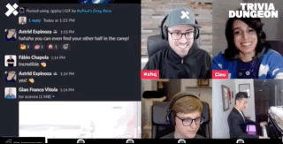

# X-Summit 2021

## Trailer Premiere



## Opening Ceremony Livestream

Behold our most epic livestream ever as we celebrated the kickoff to the X-Summit 2021.

Featuring a live performance [**Michael Schack**](https://michaelschackmusic.com/), one of the world's most well-known E-drummers, as well as plenty more which you'll find below.



## Rebellious \(iOS/Android\)

_Rebellious_ is our first-ever, open world mobile app -- available now on [iOS](https://apps.apple.com/us/app/rebellious-impact/id1583931094) and [Android](https://play.google.com/store/apps/details?id=com.rdgames.xscifi).

**Lore:** _Rebellious_ takes you to Avarus City, a city in the future ruled by the corrupt mega-conglomerate known as ShadowCorp. Self expression is considered a war crime in Avarus, and any products found by drones that aren't made by ShadowCorp get locked away in an underground facility known as..._**The Vault.**_ \(Yes, _that_ Vault\).

In _Rebellious_, you can:

* Collect [**Vault Drops**](x-summit-2021.md#rebellious-vault-drops) to earn all-new X-Team collectible loot
* Collect all **16 Data Shards** to become an [XLBL Early Adopter](x-summit-2021.md#xlbl-early-adopter-access)
* Collect coins by hacking **ATMs** or collecting & selling **Parts** from the streets**.**
* Spend your coins on: 
  * **Weapon upgrades** \(find the dealer in the Solum District\)
  * **Spray paint** \(find the spray paint dealer in any District\) to tag walls with your House sigil and increase your House's reputation
* Explore and discover more secrets & rewards in the streets of Avarus...

Watch the _Rebellious_ opening cinematic:



## Rebellious: Vault Drops

At the [Opening Ceremony](x-summit-2021.md#opening-ceremony), dozens of Vault drops -- _containing all-new, unreleased X-Team collectibles_ --  descended into Avarus City in the most historic Vault drop of all time. 

Until 24.9.21, **those same drops will continue repeating** sporadically throughout the 3 districts in Avarus \(Centralis, Solum and Vilicus\). The teleporter to the other districts can be found by following the arrow on your in-app screen.

Keep your eyes on [\#x-summit-21](https://app.slack.com/client/T0257R0RP/C02DEDYHR8X) and in Avarus itself for clues on when certain drops might happen.

Here's a look at some of the dozens of new drops if you missed them:

## Rebellious: Smuggler Drops

With Avarus alive again thanks to the rebellion bringing self expression back into the city, the city has attracted smugglers looking to sell even more contraband to citizens, **ranging from rare collectibles \(some even autographed!\) to high-end gadgets, apparel and beyond.**

Smugglers acquire goods by stealing from the ShadowCorp elite who have Vault connections. Examples:

**Here's how smuggler drops work every day until 24.9.21:**

* **Vote in** [**\#x-summit-21**](https://app.slack.com/client/T0257R0RP/C02DEDYHR8X) on which smuggler \(of 20+\) you want to help escort into the city.
* **Gain intel on when and where** the chosen smuggler will arrive. Each smuggler brings a different challenge to learn their whereabouts.
* **Find the smuggler**, pay them their fee \(using Rebellious coins\), and you'll get your shot at claiming their goods...

Check in each day in [\#x-summit-21](https://app.slack.com/client/T0257R0RP/C02DEDYHR8X) for the many ways for you to gain access to smugglers, from tagging walls in the city for your House, to playing the all-new HackBreak, and beyond.

## XLBL Early Adopter Access

XLBL is our long-awaited, all-new WFH apparel line, designed for high-performance comfort. We made this gear specifically to make working from anywhere not only more comfortable, but more modern, minimalist and sleek.

#### How do I become an Early Adopter?

There will be multiple opportunities to gain access to an **Early Adopter Pass** during the X-Summit:

* **Rebellious**: Be one of the top ranked players on the Drone Leaderboards. 
* **Rebellious**: Be one of the first people to collect ALL 16 Data Shards spread across the 3 districts.
* **Rebellious**: Early Adopter Passes will be randomly sent as Vault drops into the city, be on the lookout.
* **Sumobots Fight Club**: Only available for those who purchased the XS21 VIP Pass; rank as a top combatant.
* **Vault Charity Livestream**: Throughout the livestream, we'll give away Early Adopter passes each hour during our games/competitions/etc.



## The Battle for Avarus

Stay tuned on how you can earn the official X-Summit 2021 flagship tee, while also helping bring a new future to Avarus...

## Vault Charity Livestream



Join us September 24 as we make Vault history one last time at the X-Summit 2021.  
  
On this day, **we'll aim to generate the most Vault donations ever in one day.** To do it, we're rallying hard and partying hard.

Imagine this livestream as the chance to relive all the best events of Season 8 over the last 9 months.  
  
Donating your coins to one of our 5 featured causes will give you the opportunity to win our $5,000 Battlestation Upgrade Giveaway prize. Watch the stream to learn more and take part.  
  
Throughout the livestream, we'll also be rewarding coins and prizes as part of the many games and surprises we have in store for you, such as:

#### Trivia Dungeon

We will return one last time in 2021 to the [Trivia Dungeon](https://youtu.be/SCz7qiFBI0I), our trivia game show unlike any other.

#### Avarus In Real Life

We'll be driving a robot in a _real_ city to find _real_ Vault drops \(and hopefully not get attacked by real humans\).

**And many more events & surprises during this 5-hour livestream!**

There's no better conclusion to Season 8 and the X-Summit 2021 than this very historic day.

