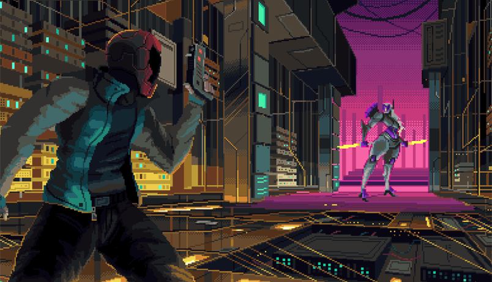

# X-VIP Guide

The XVIP is a special event focused on developers who are not yet a part of the X-team family but we're confident they'll soon be. These events are held monthly and are captained by our one and only Cavalry Team. They are meant to energize promissing developers currently going through our selection processes by providing them an early access to some of X-Team's community initiatives and games.

## The Tower

XVIP participants will have a chance to play our very own Slack-based Roguelike and maybe even get prizes based on their performance.

You enter the tower with **100HP** and just a **Vibroknife** in your inventory.  
The Tower has **10 floors** with enemies to defeat.  
Reach the final floor and **defeat the enemies to win the game**.  
If your HP is reduced to 0 you get defeated and must start the tower over.  
The player that completes the higher amount of towers in the less amount of attempts win.

During BATTLES you can select one of the following actions:

* **SEARCH**: for either WEAPONS, ARMOR or HEALTH KITS.
* **HUNT**: attacking an enemy with one of the WEAPONS in your inventory.
* **HIDE**: protect yourself from incoming attacks if the floor you are in has places to hide.
* **HEAL**: using a HEALTH KIT or other items you might have.

Weapons, Armors and Perks are divided in different categories of rarity \(Common, Rare, Epic, Legendary\) and it determines how strong they are and how likely they are to be found in searches or dropped in loots.

You advance to the next floor by reducing your opponents' HP to zero. Doing that also grants you special rewards in the form of **LOOT** \(1 to 4 items added to your inventory\) and - on even numbered floors - **PERKS** \(power ups that increase your performance in battle in a variety of ways\).

At any moment you can also run the /tower-progress command or select it from the actions menu to check your current progress. It does not count as an action in the battle.

## The Arena

During the event developer will also have a shot at a round of our beloved Slack-based Battle Royale. The Last Hunter Standing might also get a reward for his performance.

You start the game with **100HP** and nothing on your inventory but your will to fight.

From here, the game is broken into a series of rounds. Each round, you can execute **one** action.

* **STATUS**: check additional details about your inventory and conditions \(**does not count as an action**\).
* **CHEER**: support one of the players currently alive \(can be used even if you were eliminated\).
* **SEARCH**: for **WEAPONS**, **ARMOR** and **HEALTHKITS**. \(makes you visible\).
* **HUNT**: attack another **player in your BATTLE ZONE** with one of your available **WEAPONS**.
* **HIDE**: makes you **not visible** for players using **HUNT** during that round.
* **HEAL**: heal yourself or another player for **35HP** \(requires **HEALTHKIT** and can revive fallen players\).

The Battlefield is divided into several Battle Zones and will can only attack or be attacked by players within the same zone as you \(unless someone is using a special weapon that can attack from afar\).

After a certain amount of rounds a Ring of Fire might appear, destroying hiding places in every Location and transforming the Arena into an open field. When active, players won't be able to select the Hide action and will be automatically visible for all players in the same Location.

